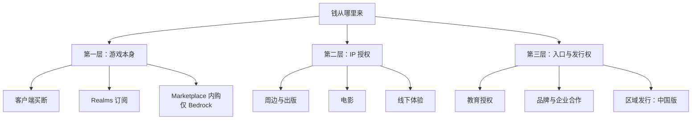

> **本章命题**：Minecraft 的收入早已不靠「只卖一次」，而买断形象仍能维持，靠的是分工——本体只负责便宜与开放，增长的钱全部在本体之外。如果本体层（客户端、订阅、内购）重新成为增长引擎，或者锁死 Java 版反而能让总收入上升，本章的判断就错了。

## 问题

2011 年，一个玩家花一百多块钱买下 Minecraft，从此再没为游戏本体付过一分钱。十四年里，他免费拿到了几百个正式版本：新方块、新生物、下界更新、洞穴与山崖的地形重做。每一次更新都不要钱，每一次都让当年那笔钱更值。

这在常识里说不通。软件公司的常规操作是涨价、加内购或者改订阅。Mojang——后来是微软——好像什么都没做，游戏却撑起了 25 亿美元的收购对价，撑起了一部约 9.6 亿美元票房的电影，还养出了一个数亿美元量级的创作者分成池。

钱从哪里来？这是本章的前半个问题。后半个问题更少有人问：钱**不能**从哪里来？微软手握一个用户以亿计的作品，却从不对 Java 版的模组抽一分钱，哪怕社区里天天有人愿意付费。

回答这两个问题，不能看玩家的账，要看公司的账。玩家的账上只有一笔：买断。公司的账上，买断只是第一层。本章把三层收入从里到外拆开，画出结构图，最后解释第 5 节那个反例——一个看起来遍地黄金、却从未成立的收入来源。

## 「只卖一次」早已不是全貌

先看收购前的底子。按瑞典公开的公司登记记录，Mojang 在被收购前的 2013 年，年收入已是数亿美元量级，利润上亿美元量级——这是量级口径，精确数字依赖当年年报的媒体转述，本章不作精确引用。那笔钱几乎只有一个来源：卖拷贝。2013 年的 Mojang 是一家「只卖一次」的公司：每个玩家付一次钱，公司拿它付工资、做更新。账很好算，也很脆弱——销量不涨，收入就停。

收购之后，账本变了。今天这个品牌的收入大致分三层，每一层对应一个不同的付费理由：

三层的分界不是产品，是「谁为什么付钱」。第一层，玩家为玩游戏付钱：买断客户端、订阅官方服务器、在商城里买内容。第二层，别人为使用这个 IP 付钱：玩具厂、出版社、片厂拿 Minecraft 的形象去做别的东西，Mojang 收许可费和分成。第三层，机构为「入口」付钱：学校买课堂工具，品牌买营销场景，地区市场的本地公司买运营权。

分层的意义在于风险隔离。电影扑了，不影响游戏更新；商城被骂，不影响 Java 版；中国版审核再严，也管不到世界其他地方的服主。每一层各自成立、各自失败，本体只做一件事：保持便宜、保持开放、持续更新。这就是「买断」形象与多元变现能并存的机制——不是谁克制，是结构使然。

还有一句丑话说在前面：这套分层是从产品形态倒推的，不是从报表读出来的。微软从不单独公布 Minecraft 的收入构成——客户端、Realms、商城各占多少，外界不知道；唯一一份硬数据，是收购前瑞典登记记录留下的孤证。所以本章能给你的不是占比，是结构：哪些位置在收钱、为什么收得上。

<Alternative title="如果不分层：把本体做成订阅">把本体改成月费是最容易被想到的替代方案，行业里有现成样板：网络游戏月卡。它短期内大概率能多收钱，但会把入口抬高一层——付不起月费的孩子、想先试后买的人，全被挡在外面。Minecraft 真正的资产是「谁都能进来」，订阅制拿入口换收入，对微软是亏本生意。这是算账，不是道德。</Alternative>

接下来三节，从里到外把三层各拆一次。

## 第一层：客户端、Realms、Marketplace

第一层是玩家最熟悉的钱，三样东西：客户端、Realms、Marketplace。它们在 Java 与 Bedrock 两条产品线上长得完全不同。

**客户端。** Java 版是教科书式的买断：付一次钱，永久资格，免费更新，美元区定价长期停在二十多美元一档，十几年基本没动。Bedrock 版复杂些：在手机上，它从来不是买断——应用免费下载，进游戏后一次性付费解锁完整模式，外面再挂各种内购；在主机和 Windows 商店，则表现为一次性买断。所以严格说，「买断」从来只是这款游戏在部分平台上的收费形态。玩家以为的「Minecraft 是买断游戏」，其实是 Java 版的合同。

**Realms。** Realms 是官方的月租服务器：付订阅费，官方替你托管一个小型联机世界，朋友随时能进，不用自己开机、配网络、管白名单。两条线都有，但合同不同：Java 版只有一档，每月 7.99 美元，最多 10 人；Bedrock 版分两档——Core 每月 3.99 美元、2 人，Plus 每月 7.99 美元、10 人，另捆一批商城内容包和更大存档[^realms]。

Realms 卖的不是内容，是省事。它的能力刻意弱于第三方服务器：不能装插件，不能装模组，世界设置处处受限。这个「弱」是设计出来的——官方托管只吃「家长和孩子想要一个不折腾的联机」这个市场，把「要完全控制权」的市场留给第三方。玩家为什么愿意付这一档钱？因为替代方案是学会自己开服，学习成本就是 Realms 的定价空间。

**Marketplace。** Marketplace 是 Bedrock 独有的官方内容商城，2017 年 4 月随手机版更新上线[^marketplace]。玩家用真实货币兑换虚拟币 Minecoin，再用 Minecoin 买社区作者做的地图、皮肤、材质与玩法。不是谁都能上架：内容必须出自官方合作伙伴计划的成员，并逐件通过 Minecraft 内容团队审核。到 2026 年年中，商城内容数以万计，来自三百多位创作者（wiki 口径）[^marketplace]。

<Impl title="Minecoin 闭环">Marketplace 的关键机制是货币闭环：玩家先用真实货币买 Minecoin（例如 19.99 美元兑 3500 币这一档），再用 Minecoin 买内容。钱先进微软的账，事后按合同与创作者结算。好处是定价权、结算权、用户关系都握在平台手里；代价是社区长期抱怨余额花不完、退款麻烦。做内容平台先做货币，这一步抄得走——前提是你愿意背结算与合规的负担。</Impl>

这个商城的成绩有一个官方数字：到 2021 年 4 月，创作者累计分成超过 3.5 亿美元，对应超过 10 亿次内容下载——微软在财报电话会上给出的口径，此后还在增长[^payout]。对社区作者，这是 Java 生态里长期拿不到的东西：一条合法收钱的通道。

<Note>3.5 亿美元是付给创作者的分成，不是微软的收入。按平台抽成的行业惯例倒推，商城总流水应高于这个数；微软没有公布过确切分成比例，这句只做量级推断。</Note>

好与坏各说一半。好的一面：Marketplace 证明「玩家愿意为玩家的创作付钱」，养出了一批全职内容团队。坏的一面：它是审核制、专用格式、绑定微软账号与货币的封闭生态——能上架什么、用什么格式、怎么定价，都由平台说了算。add-on（Bedrock 官方内容格式）的数据驱动架构如何服务审核与跨端，见[《Bedrock 作为另一次实现》](/impl/bedrock)。

## 第二层：周边、电影、出版、主题公园

第二层的钱有一个共同名字：授权。Mojang 不亲自做玩具、拍电影、写书，它把 Minecraft 的形象授权出去，收许可费和分成。别人出本钱、担风险，Mojang 出形象、收租。

这一层的历史比很多人以为的长。2011 年底，乐高众创平台 Cuusoo（后改名 LEGO Ideas）上出现 Minecraft 提案，投票很快达标，第一批乐高 Minecraft 套装 2012 年上市——那时这游戏还是一家独立小公司的产品。此后乐高系列成了长销线，套装出了一代又一代。出版同理：官方授权的操作手册与年鉴是书店里的长销品，孩子在货架上认识苦力怕，不需要先有一台游戏机。

2025 年的《A Minecraft Movie》是这一层的量级标尺：全球票房约 9.6 亿美元，制作成本约 1.5 亿，华纳兄弟出品[^movie]。票房不等于 Mojang 的收入——片厂与版权方按合同分账，比例未公开——但量级说明问题：这个 IP 的变现能力已经不需要游戏本体在场。买票的观众大量是早就认识苦力怕的人；电影不是拉新的广告，是对既有认知的收成。值得一提的是，这个项目 2014 年就由华纳宣布过，此后换了多轮导演与剧本，拖了十一年才上映——授权层的另一面：节奏不在 IP 方手里，难产的成本也由对方担。线下体验同理：乐高乐园里的 Minecraft 主题区、各地的官方周边店，都是把「认识 Minecraft」变成可收费的场景。

为什么变现要拆到这一层，而不是直接在游戏里收？因为付费意愿长在不同的人身上。为玩具付钱的是家长，为电影付钱的是假期档观众，为游戏付钱的才是玩家——三种钱包、三种场景，硬塞进一个客户端，每一边都会挤坏别人。更关键的是风险位置：授权模式的失败成本由被授权方承担。电影扑了，亏的是片厂，Mojang 少收一笔租，游戏照常更新。

<Note>授权层的品控风险也比一般 IP 小：方块的视觉语言足够简单，玩具怎么做都像 Minecraft，跨媒介失真度低。</Note>

## 第三层：教育、企业、区域发行权

第三层最不像「卖游戏」：买家不是玩家，是机构。

**教育。** Minecraft Education 是基于 Bedrock 的课堂版本，2016 年 11 月正式上线，前身是社区做的 MinecraftEdu——老师自发拿原版上课的野生长，被收编成产品[^education]。它不按游戏的方式收费，按软件的方式收费：学术机构每用户每年约 5 美元，整校采购另有批量价；更大的动作是把它直接装进微软 365 教育版 A3、A5 套装白送[^education]。买单方是学校预算，不是孩子零花钱。

这一层的商业逻辑要诚实写：教育版既是「游戏进课表」的入口工程，也是微软向学校推销整套订阅的钩子——白送的前提是学校已经在 365 的合同里。两个动机不冲突，可以同时为真。它也被批评离「那个 Minecraft」很远：课堂要的是可控、可管理、可评分，恰好与自由改装相反。而这正是它成立的条件——机构付费买的从来不是自由，是确定性。

**企业与品牌。** 把 Minecraft 当媒介用：品牌在里面建体验、办营销活动，付合作费。这一层单笔金额不大，公开案例有限，但逻辑与教育一致——机构借 Minecraft 触达年轻人，Mojang 收场景费。机制上它与授权层相同，只是买家从玩具厂换成了营销预算。这层公开案例少，不是因为它不存在，而是因为合作合同几乎都带保密条款：你见得到成品，见不到价格。

**区域发行。** 这是第三层里最重的一块：中国版。

2016 年 5 月，微软、Mojang 与网易联合宣布，把《我的世界》在中国大陆的运营权交给网易；同年 10 月，Java 版的代理也补签进来。2017 年 8 月，Windows 端（Java 版）上线，9 月 iOS，10 月 Android。合同与全球版完全不同：免费下载，内购变现——1 钻石兑 1 分钱人民币，会员每月 20 元——聊天、告示牌、书本文字全部过审，租赁服务器连名字都不能起，只能用数字 ID。注册用户按官方口径一路走高：2019 年 11 月 3 亿，2020 年 11 月破 4 亿[^china]。

同一个品牌，两种合同。为什么中国版可以是另一个样子？因为「发行」这件事的成本结构不同。中国大陆的游戏市场有一套独立的制度：版号审批、内容审核、实名与支付接入、渠道分发。微软在这些环节没有本地能力，硬做等于从零建一支合规与运营队伍；网易有牌照、有渠道、有支付关系。于是最优解是把运营权整体授出去。**区域发行**指的就是这种合同：某地区的运营权作价，换本地公司替你完成全部本地合规。网易不付拷贝的钱，它自己用免费加内购从中国市场收钱，微软按合同分账。

<Constraint name="区域发行" verdict="地基" chain="本地合规与渠道成本高 → 运营权整体授予本地公司 → 同一品牌出现两种合同 → 各自市场各自最优，代价是体验分叉" />

好与坏各说一半。好的一面：数以亿计的中国玩家以零门槛进了门，任何买断价在这个市场都会把大多数人挡在外面。坏的一面：审核制重塑了内容生态——服务器匿名化、聊天过滤、内容过审——让中国版与世界其他部分之间出现一道体验上的落差。

<Memoir title="两个世界的玩家词表">中国版上线后，社区里最常见的对比帖是「同一个游戏、两个世界」：国际服玩家的常用词是整合包、白名单、服务器域名；国服玩家的常用词是钻石价格、过审节奏、租赁服编号。让「服务器有自己的名字」这句话在国服不成立的，不是技术，是审核规则——租赁服只能用数字 ID[^china]。</Memoir>

第三层的共同点：买家买的都是「入口」——通向课堂、通向年轻人、通向一个市场。这与前两层不同：第一层卖体验，第二层卖形象，第三层卖位置。

## 不能从哪里来：为何「给模组抽成」从未成立

最后回答反过来的问题。先列清单，看看哪些钱从来没被收过：

- Java 版的模组绝大多数免费，作者靠捐赠和赞助维持，官方不抽成。
- 第三方服务器的会员、地图、充值收入，官方不抽成，只画合规红线。
- CurseForge、Modrinth 这些模组站的流量与捐赠，官方不抽成。
- Java 版本体一次付费后再无收费点，连可选内购都没有。

玩家社区每隔几年就流传「微软要出官方模组商店」的传闻，每次都引发抵制。有意思的是：这种在别的游戏里习以为常的模式——平台抽三成那种——在 Java 版上连一次正式尝试都没有发生过。为什么？

先排除情怀解释。「微软尊重 PC 开放传统」不是机制，撑不起一个商业决策。机制原因有三条，环环相扣。

第一条：**分发节点不在微软手里**。Java 版的模组是一个个 jar 文件，从 CurseForge、Modrinth 或作者自己的网页下载，用免费的加载器（Forge、Fabric 等）装进游戏。官方想抽成，前提是控制分发节点；但 Java 版的官方启动器只是众多入口之一，玩家可以完全绕开它。要抽成，得先锁死分发——强制签名、强制商店、封杀侧载（绕开商店直接装文件）。技术上做得到，代价是杀死「自由改装」本身。

第二条：**服务端是玩家的资产**。Java 版联机的主体是第三方服务器，服务器软件免费公开发布，开服权在任何人都手里。全世界的付费服务器生态——会员制、地图票、皮肤——都长在微软摸不着的机器上。官方在这条线上连通道费都收不到，何谈抽成。对比 Bedrock：Realms 与官方认证的合作服务器是仅有的正规联机通道，通道在手，才有商城那套审核与分成。两条产品线的商业差别，根子在技术架构的差别——分发是否可控，先于一切商业设计（见[《服务器即新游戏》](/history/servers)与[《Bedrock 作为另一次实现》](/impl/bedrock)）。

第三条：**免费替代品零成本**。Java 版每一个可能的付费点旁边都站着一个免费替代品：官方 Realms 之外是满地的第三方托管，假想中的官方模组商店之外是 CurseForge 和 Modrinth。抽成等于给用户一个搬家的理由，而这个家没有锁。Bedrock 用户「不搬家」不是因为忠诚，是因为手机端没有侧载文化、商店是唯一入口、资产绑定在微软账号上。锁定程度决定抽成可行性；Java 版的不可锁定，就决定了抽成不可行。

三条合起来：抽成机制的成立条件是「平台控制分发」，Java 版的设计前提是「分发不可控」，两者矛盾。所以「给模组抽成」从未成立——不是不想，是账算不平：锁分发的成本（社区流失、入口贬值）远大于抽成收益。Marketplace 的成功恰恰是同一个判断的反面注脚：微软没有接管 Java 的自由生态，而是另建了一个从第一天就可控的生态。Java 作者想收钱，现实路径是把作品移植成 add-on 上架商城，而作者身份随之从「社区成员」变成「签约伙伴」，这一步的代价见[《模组作为第二作者》](/history/mods-as-authors)。

官方离「抽成」最近的一次，是 2014 年收紧用户协议、限制服务器的收费方式——那场风波的机制与余波，见[《模组、服务器与灰色经济》](/history/grey-economy)。

<Constraint name="Java 分发不可控" verdict="地基" chain="模组是自由文件、加载器免费、启动器可绕开 → 官方没有分发着力点 → 抽成机制不成立 → 生态免费是结构结果，不是情怀" />

有人会问：一点都不抽，微软图什么？图入口保值之外，还有一笔不进分成表的账——人才。Java 模组与服务端社区是行业的人才蓄水池，Mojang 自己就收编过一整批服务器插件作者进开发团队。这笔收益长在招聘市场上，抽成机制反而会掐断它。

本节的证伪条件写清楚：如果哪天 Java 版要求模组强制签名才能加载，或官方专用格式开始取代 jar 分发，说明「分发不可控」的地基已被拆除，抽成会重新变得可能，本节作废。截至写作时，没有发生。

## 这一章留下什么

- **爱好者**：判断「微软会不会动 Java 版」，别看口号，看收入结构——增长的钱全在本体之外，Java 版的开放是给整个结构供血的位置，动它不划算。
- **开发者**：能抄走的是变现分层——本体、服务、IP、入口四类收入分开定价、互不担保，让本体保持便宜以保住入口。抄不走的是 Marketplace 成立的前提：从零建一套可控分发（自铸货币、审核制、账号绑定）；你若接管的是一个已经自由的生态，抽成机制天然不成立——这是架构问题，不是运营问题。

[^realms]: Minecraft Wiki, *Realms*（订阅价格与档位，2026-09 查询：Java 版 7.99 美元/月；Bedrock Core 3.99 美元/月、Plus 7.99 美元/月）；见 <https://minecraft.wiki/w/Realms>。

[^marketplace]: Minecraft Wiki, *Marketplace*；见 <https://minecraft.wiki/w/Marketplace>。

[^payout]: PC Gamer, *Minecraft modders have sold a billion mods for more than $350m since Microsoft bought it*, 2021；见 <https://www.pcgamer.com/minecraft-modders-have-sold-a-billion-mods-for-more-than-dollar350m-since-microsoft-bought-it/>。

[^movie]: Wikipedia, *A Minecraft Movie*（票房引 Box Office Mojo 与 The Numbers）；见 <https://en.wikipedia.org/wiki/A_Minecraft_Movie>。

[^education]: Minecraft Wiki, *Minecraft Education*；见 <https://minecraft.wiki/w/Minecraft_Education>。

[^china]: Minecraft Wiki, *Minecraft: China Edition*；见 <https://minecraft.wiki/w/Minecraft:_China_Edition>。
