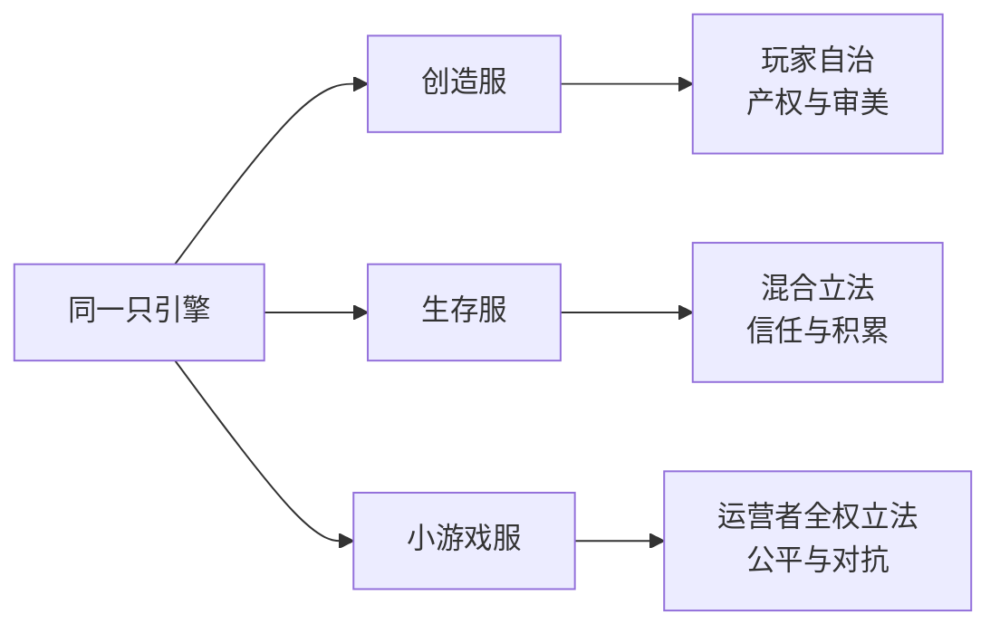

> **本章命题**：很大一部分「游戏」不在客户端里——它们活在服务器上，由玩家中的运营者创造和维持；而这层基础设施长期缺乏官方保障，因此比游戏本体更脆弱。

## 问题

先回忆一个场面。你登录一台服务器，玩了一晚上「起床战争」：四支队伍各守一张床，床在，死了就能复活；床被拆掉，再死一次就出局。铁锭和金锭是钱，在商店里换装备，最后活下来的队伍获胜。你玩得很熟。

现在退出游戏，打开你自己的安装目录，在游戏文件里搜「床」「战争」「BedWars」。什么都搜不到。那张地图不在你硬盘上，商店的价格表不在，复活规则也不在。你花了一百多块钱从 Mojang 买来的那个程序里，根本没有这个东西——不是没有中文翻译，是根本不存在。它只存在于你昨晚连的那台服务器上。

这不是特例。起床战争、天空战争、空岛生存，加上几乎所有你叫得出名字的 Minecraft 玩法，全都不在客户端里；它们是服务器发明的[^skyblock]。世界上玩家最多的那台服务器，把官方玩法原样玩过一遍的人，比想象中少得多。换句话说：你为游戏付了钱，但你玩的「游戏」有相当一部分是别人另外做的，不收你版权费，也不受 Mojang 管辖。

所以本章要回答的问题是：**为什么很大一部分「游戏」不在客户端里？它们是谁做的，靠什么活着，又为什么会在 2014 年差点一起塌掉？** 最后那半句不是悬念修辞——那一年，游戏本体一天没停更，而全世界大部分多人服务器的地基差点被一纸法律通知掀翻。要解释这两件事为什么能同时成立，得先回到 Minecraft 最基本的一个结构。

先把本章的边界说清楚。这章不教你怎么开服务器，不做服务器推荐，也不盘点插件——那些是手册的事。这里关心的是三件事：为什么这个生态会长成这样，它在社会层面做了什么实验，以及它给「再开发一个游戏」这件事留下了什么教训。另外，单机玩家和服务器玩家过着的几乎是两个平行世界：一个人可以玩十年 Minecraft 而从没进过服务器，他得到的是 Mojang 设计的那个游戏；另一个人百分之九十九的游戏时间都在服务器上，他得到的是某个运营者定义的另一个游戏。两人聊起「Minecraft 好玩在哪」，很可能完全聊不到一起去。这件事本身，就是本章的题目。

## 买的是客户端，玩的是服务器

Minecraft 其实是两个程序。一个叫客户端，装在你电脑上，负责画面的呈现和键盘鼠标的输入；另一个叫服务端，跑在某台机器上，负责世界数据、生物、掉落判定和一切规则的执行。你玩单人模式时，两个程序在同一台电脑里悄悄通信；你玩多人模式时，服务端在地球另一端，你屏幕上的一切——别的人、别的建筑、掉落的物品——都是服务端通过网络发来的「转播」。这个结构有一个每个玩家都体验过的证据：网络卡的时候，你还能看见自己走动，但别人停在原地，方块半天碎不掉——因为「世界真正发生了什么」不由你屏幕决定，而由服务端决定；你看到的只是延迟抵达的转播信号。反过来，服务器半夜重启的那几十秒，你连不上它，但那个世界并没有消失，它只是暂时不接受观众。

关键在于：官方从来没有规定，服务端必须是官方写的那个。客户端和服务端之间的通话格式（一套双方约定的消息规则，行话叫协议）没有官方文档，但它是可以被逐条观察和破译的，社区早就整理出了完整的非官方文档。任何人都可能照着这套格式自己写一个服务端，只要消息对得上，官方客户端照样连得上。这是写在架构里的可能性，不是后来打的补丁；技术细节在[《服务端与规模》](/impl/servers)里展开。

2010 年 9 月，社区里出现了一个叫 hMod 的项目：把官方服务端改造成可以装「插件」的版本。插件就是装在服务器上的小程序，负责改规则——圈一块地不许别人动、禁止有人乱扔岩浆、提供传送指令。玩家这边什么都不用装，进服就能玩。为什么 2010 年冒出来的是这个东西？因为那正是 Minecraft 多人需求爆发的前夜：买游戏的玩家越来越多，论坛上的服务器招人帖一天比一天多，而官方服务端连基本的管理工具都寥寥无几。同年 12 月 21 日，更完整的接棒者开工，它就是后来几乎统治 Java 版服务器世界的 Bukkit[^wiki-server]。

为什么是这样，而不是别的？2010 年的 Mojang 是一家刚成立的小公司，官方服务端在高人数下又慢又脆，而玩家的真实需求——几百人的社区服、跨时区的公共服——它自己根本满足不了。摆在面前的是两条路：像很多游戏公司那样封杀第三方服务器，或者默许它长大。Mojang 选了后者，并且在 2012 年 2 月 28 日走得更远：Bukkit 的四位核心开发者受雇加入 Mojang，官方博客的标题叫「Minecraft 团队壮大！」，打算以他们为基础做官方的服务器扩展接口[^mojang-2012]。对比其他游戏里「私服」的灰色地位，Minecraft 的服务器生态几乎是唯一一个被官方迎进门、险些转正的。

<Constraint name="服务端可替换" verdict="地基" chain="客户端只是终端 → 规则与内容活在服务端 → 服务端可以整只换掉 → 你玩到什么游戏由服务器决定" />

由这条链得出本章第一个判断：**你从 Mojang 买到的是进入这个世界的终端，而你玩到的内容，很大一部分由你连的那台服务器决定。** 这句话怎样算它错了？两种情况：如果官方客户端本身提供了服务器上的那些玩法（官方多年没做，做了规模也远不及）；或者如果 Mojang 曾把第三方服务端当成侵权来打击（事实正相反，它把作者招了进去）。两者都不成立，判断就还站着。

这个结构还顺带改写了一件事：买断制的含义。你一次付钱买下的，是一个可以连接任何世界的终端，而世界本身的内容在别处持续生产，年年翻新，分文不取。别的游戏把「新内容」做成付费资料片，Minecraft 把新内容的生产线外包给了自己的玩家——服务器越多，官方自己要做的反而越少。这不是 Mojang 当年设计好的战略，它只是一个不会写代码的架构决定自然长成的结果。

## 三种社会：创造服 / 生存服 / 小游戏服

服务器生态长出了三种主要形态。它们跑在同一个引擎上，画面也几乎一样，差别不在画面，在规则，以及在规则之下人与人的关系。

**创造服**的主题是「一起建」。世界往往是一片平整的空地或规划好的城区，玩家拿创造模式——方块无限、可以飞——专心盖东西。因为原版生存里一个新玩家半小时就能炸掉别人一年的心血，创造服必须立法：最基本的一样工具叫领地插件，用法是站在这块地上敲一条指令，从此别人挖不动、炸不坏，等于一张产权证。有了产权，才有了街区、市政、公会仓库，才有「这条谁来修路、那座灯塔归谁管」的日常政治。成熟一些的创造服会长成真正的城市：有人专修路网，有人管车站，有人开建材仓库免费发方块，逢年过节全服合办一场建筑比赛。再往细处走，还有玩家自发排练的剧本，让访客在城里遇到「演」出来的角色——建筑服慢慢长出了戏剧。它的社会关系是邻里，主要矛盾是产权与审美。

**生存服**把官方的生存规则原样保留，往上加一层玩家社会。经济插件给世界配上货币：玩家用指令开店，标价卖出挖到的钻石，钱能存能贷；领地插件保护财产；管理员裁决纠纷。生存服真正卖的东西，其实是「一个不会消失的世界，和一群一直在场的人」——挖矿所以有意义，是因为钻石能卖给别人；盖房所以有意义，是因为会有人来看。也因此它的主要矛盾是信任：官方规则里一切都能偷能炸，服主必须用法律把这份野蛮圈起来，合作与财富才积累得起来。而只要经济跑得够久，它还会自己长出教科书级别的现象：某个东西被挖太多就贬值，玩家自发换一种更难获得的资源当硬通货，通货膨胀和金本位这些经济学课的名词，在一个十几岁的玩家社群里被亲身重演。国家之间的戏码也一样：城市邦联、互不侵犯条约、间谍与背叛——这些都不是官方设计的玩法，是社会在生存压力下自己长出来的。服务器是 Minecraft 多人形态的承重结构，这一点卷二的[《多人是默认状态》](/design/multiplayer)会专门论证，这里看到的是它落地后的样子。

**小游戏服**则把玩法整个换掉。起床战争、天空战争、空岛生存——这些玩法的共同点是：服务器提供大厅、排队、匹配、计分和局内商店，玩家进去就是一局十几分钟的对抗，出来再排下一局。社会关系是陌生的对手，主要矛盾是公平，所以它的规则最密：反作弊、局内平衡、赛季重置，全由运营者一天一天地维护。十几分钟一局这个设计不是随意为之：一局的成本足够低，输了立刻能再来一把，赢了立刻有正反馈——它把 Minecraft 从「经营一个世界」变成了「来一局」。两种乐趣都成立，但它们其实不是同一种游戏。

为什么客户端装不下这三种社会？因为它们的原料不是代码，而是「很多真人」和「一个裁判」。客户端可以在单机里模拟规则——这也是为什么空岛生存作为单人地图早在 2011 年就在论坛上流传，用一桶岩浆一块冰的起步条件把每一份资源都算计着花——但模拟不了对手，也模拟不了管理员。真人和裁判都只在服务器上，所以这部分「游戏」只能活在服务器上。

顺带交代另一条世界线：基岩版（手机、主机上跑的那版）有自己的官方租赁服务 Realms 和自己的第三方服务器体系，但本章讲的服务器文化——插件、服主、小游戏——几乎全是 Java 版的产物。两个版本在这里的分岔细节，见[《基岩版》](/impl/bedrock)与[《Java 版与 Bedrock 版》](/history/java-bedrock)，本章不展开。

## 极限样本：Hypixel、2b2t——各说明一种政治

三种社会之外，还有两个经常被相提并论的名字。把它们放在一起，不是比谁大，而是看「运营者」这个角色能走到哪两个极端——一个把立法权用到极致，一个把立法权弃置殆尽。

**Hypixel 是「运营者全权供给」的极端。** 它 2013 年 4 月上线，创办人西蒙·柯林斯-拉弗拉姆（Simon Collins-Laflamme）与菲利普·图谢特（Philippe Touchette），入行前就以制作冒险地图闻名[^wiki-hypixel]。它把小游戏做成了产品矩阵：等级、货币、任务、通行证，规则、平衡、内容全部由一支职业团队供给。玩家不需要会玩 Minecraft——不会合成表无所谓，游戏里的一切都是按钮；你排队、被匹配、按小节拍玩完一局，然后领奖励。2020 年疫情期间，它的日峰值在线冲到约 15 万人，2021 年 4 月更是超过 21 万人同时在线，是被吉尼斯世界纪录认证的最受欢迎的 Minecraft 服务器[^wiki-hypixel]。后来它连空岛生存也做了自己的版本，同样大获成功；2020 年，围绕这个社区成立的游戏工作室被 Riot 收购——一台服务器长成了一家游戏公司。

这说明了什么政治？Hypixel 的模型接近一家电视台：节目单由运营者排，玩家是观众兼用户，用脚投票。所有立法权集中在运营者手里，好处是体验稳定、新手零门槛，代价是玩家对世界的塑造力被压缩到近乎零——你连一块方块都留不下来。这是一种中心化的秩序，效率极高。它的生意严格地在 EULA 的框架内运转——EULA 就是最终用户许可协议，玩家每次安装游戏时点「我同意」的那份合同——卖外观、卖等级、卖「好看」，不卖影响平衡的优势。2014 年那场收费风波（本章稍后会讲到）之后，它恰恰是新政最典型的受益者，因为规则越清楚，越是大玩家越舒服。

<Memoir title="不会合成的一代">

在 Hypixel 玩家里，有整整一代人的「Minecraft」就是起床战争：他们能熟练地速通铁锭、拆掉对面的床，却说不太清熔炉怎么烧矿、苦力怕晚上怕什么。这不是笑话，是社区里被反复谈起的现象——对他们来说，原版生存反而是那个陌生的「新玩法」。当一台服务器的用户规模超过许多国家的人口，它定义的「Minecraft 是什么」，比官方客户端更有说服力。

</Memoir>

**2b2t 是「运营者退场」的极端。** 它创办于 2010 年 12 月，全名 2builders2tools，自称也被公认是「Minecraft 最古老的无政府服务器」[^wiki-2b2t]。它的运营者从不露面，社区只知道一个 ID：Hausemaster。所谓无政府：没有管理员裁决纠纷，死了不救、被偷不赔、被拆不封；运营者几乎不干预，仅保留极少数维护——比如修补那些会让整个世界坏掉的漏洞。剩下的全由玩家自己搏。想要安全，最可靠的办法是往荒原深处走十万格再安家——用距离换安全，是这个世界的第一条生存法则，因为人类的恶意跑得再快也要一格一格地跑。想要积蓄，就自己学会防贼、藏库、保密坐标。于是这个世界长出了自己的全套社会现象：阵营与战争、编年史与神话、以毁坏他人作品为乐的「破坏者」（griefer），以及反过来，把这些破坏当作历史的证据去远征朝圣的人。2016 年，一段探访视频引来大批新玩家涌入，老玩家在出生点围追堵截也没能拦住，服务器自此第一次装上了排队系统——你看，无政府也得有门卫，这是它历史上少有的几次干预之一[^wiki-2b2t]。

这又说明了什么政治？运营者放弃立法之后，秩序并没有消失，而是退回到它的原始形态：谁能组织起更多人、更狠的进攻和更严的保密，谁就是法律。这里要按本章的纪律说清楚：2b2t 在这里只作为一个**无规则的极限实验**出现——它证明的是，规则不是 Minecraft 自带的属性，而是运营者的选择，连「放弃一切规则」本身也是一种政治决定。至于这个实验里那些猎奇的传闻，本章一律不展开，因为它们与论点无关。

两个样本合起来，才是完整的教训：同一天、同一个客户端、连上这两台服务器，你会得到两个完全不同的「Minecraft」。游戏叫什么名字由 Mojang 定，游戏是什么内容由服务器的政治定。而且这两台都不是边缘实验——一台是认证过的世界最大，一台是最年长、至今存活。中心化和无政府，在这个引擎上都被验证过可以养活几十万人年的游戏时间；剩下数不清的普通服务器，只是在两极之间找自己的位置。

## 玩家成为运营者：管理员、经济、规则

[《模组作为第二作者》](/history/mods-as-authors)讲的是用劳动扩建游戏本身的人。这一章讲的另一群人：服主，也叫管理员。他们的劳动清单比大多数玩家以为的长得多：租机器、装系统、跑服务端、挑插件、改配置、防攻击、定期备份、拉新玩家、在群里回答问题、半夜被叫起来重启，以及最重要的——裁决人与人之间的吵架。这份劳动在 2014 年之前几乎没有合法的收入渠道，绝大多数人是用业余时间和自己的钱包在养一台几百人的服务器。

他们的主要工具就是插件。插件的工作原理其实很简单，值得花三句话讲清楚：服务器在「一个方块被破坏」「一个玩家进入世界」这类事情发生的瞬间，会向所有插件广播一条消息；插件事先登记好「听到这类消息就执行什么」，于是在事件发生前的一瞬间改写结果——把「方块碎掉」改成「拒绝：这是领地」。规则因此不再是写死在游戏里的代码，而是一条条可以随时增删的判例。这套机制当然可以做得更精致，但那是实现细节，跳过不表。

<Impl title="事件监听：改规则的最小切口">

上面说的「广播—登记—改写」，行话叫事件监听，是 Bukkit 留给整个生态最重要的发明之一。服务端在每次方块被破坏、玩家受伤害、物品被点击之前，把「发生了什么、涉及谁」打包成事件对象交给插件；插件返回「取消」或修改参数，服务端就按改过的结果执行。领地、经济、小游戏，全是在这一个切口上长出来的。它优雅的地方在于：插件不需要理解服务端内部怎么算物理和光照，只需要在事件这一层表态——权力被切得又小又够用。

</Impl>

看几个典型的插件，你会发现它们做的事有一个统一的名字：立法。领地插件是产权法。原版生存的默认规则是「自然状态」：谁的拳头硬谁说了算，你盖的房子随时可能被拆。领地插件重新分配了权利——圈地之后，这块地上「别人的破坏权」被法律（插件代码）直接剥夺。经济插件是货币与市场法：它规定什么叫钱、怎么定价、玩家之间怎么交易，有的服务器甚至做了税收和破产救济。小游戏插件立法立到了最高层——它直接规定「这里的游戏是什么」，如我们在起床战争里看到的。封禁与禁言是刑罚，管理员是法官。

由此得出一个平时很少有人明说的结论：**在一台服务器内部，管理员对日常生活的权力大于 Mojang。** Mojang 写的代码管不到你服务器上的地价、利率和刑法；它唯一管得到的，是下面这件事——你和玩家之间的钱怎么收。可以换个角度感受这件事的分量：在现实中，一个国家的中央政府通常管国防和货币，地方政府管水电和治安；Minecraft 里正好反过来，官方管着头顶上的宪法（EULA），柴米油盐的立法权全在民间。服主是这个世界真正的地方政府，而地方政府的人数，比 Mojang 的员工多出几个数量级。这恰好引爆了 2014 年的第一场危机。

2014 年 6 月，Mojang 在官方博客发表《我们来谈谈服务器变现》，第一次系统性地划定服务器收费的红线：可以收入场费，但只能收一种票，不得把玩家分成付费和免费两个等级；可以在世界里放广告；必须声明收费与 Mojang 无关；目标写得明明白白——防止服务器变成「pay-to-win」，也就是花钱就能买到影响平衡的优势[^mojang-2014-eula]。随后几个月里官方又以问答等形式多次澄清和放宽细节。

这件事上，三方各有各的道理，值得把每一方的道理都听完。**服主**的理由：带宽和机器是真金白银，多年劳动想换点回报天经地义，而且当时卖 VIP 特权已经是通行多年的做法，很多人入坑时玩的服务器就是这么收费的——一夜之间，整个行业发现自己「违法」了，反弹自然激烈。**Mojang** 的理由：版权在它手里，法律上「不允许别人从我们的产品获利」本就是 EULA 写了多年的条款，只是过去不执行；同时它有生态层面的考虑——pay-to-win 摧毁新玩家的体验，而新玩家是整个生态的血液。**玩家**则分成了两派，一派受够了人民币玩家的碾压，一派觉得付费支持服务器理所当然。没有哪一方是无理取闹：Mojang 行使的是它法律上显然拥有的权利，服主的诉求也符合多年形成的惯例。真正的问题是，此前很多年，双方都把「沉默」当成了合同——Mojang 沉默，服主就当作被默许；这个合同从来不存在，只是没人去戳破。

这场风波也把本章的权力结构补完了。官方在游戏内提供的指令和数据包是一套「官方立法工具」（见[《规则由谁制定》](/design/who-makes-rules)），插件是民间立法，EULA 是顶在上面的宪法。三层法律体系叠在同一个游戏里：管理员定的法管玩家怎么活，EULA 管管理员怎么收钱，而 EULA 之上的更高法院，是版权法和一家瑞典公司的裁量。

<Note>把「沉默当合同」的不止服主和 Mojang——下一节你会看到，Bukkit 生态对 Mojang 的信任，也是这么塌的。</Note>

## Bukkit 危机：基础设施的脆弱

先把结论放在前面：2014 年秋天，Minecraft 的游戏本体一天没停更，而全世界大部分 Java 版服务器的地基，差点被一纸法律通知掀翻。游戏没事，基础设施差点死了。这句话本身就是本章命题的后半句，它值得用一整节的篇幅来验证。

Bukkit 的故事从 2010 年讲起。它 9 月的前身 hMod 开工，12 月 21 日 Bukkit 项目启动[^wiki-server]。它的结构从一开始就埋着雷：项目分成两半，一半是接口定义（Bukkit，按 GPL 许可证发布——GPL 的意思是「谁用了我的代码做衍生品，衍生品也必须开源」），另一半是让它真正能跑起来的实现（CraftBukkit，按较宽松的 LGPL 发布）。麻烦在于，CraftBukkit 的做法是直接在 Mojang 的官方服务端上动手术，里面必然混着 Mojang 的专有代码。把专有代码混进 GPL 体系再分发给全世界，法律上从第一天起就说不清。当年没人较真：大家都默认 Mojang 睁一只眼闭一只眼，这种默认会一直持续下去。

2012 年 2 月，四位 Bukkit 核心开发者受雇加入 Mojang（就是前文那篇「Minecraft 团队壮大！」），承诺中的官方服务器接口始终没有到来[^wiki-server]。2014 年 6 月，EULA 风波。同年 8 月 24 日，Bukkit 团队的 Warren Loo（社区 ID：EvilSeph）宣布项目终止开发。紧接着 Mojang 表态：作为当年入职安排的一部分，Bukkit 项目的权利早已转移到 Mojang 手中，Mojang 将接管维护。听起来像一场体面的收编。

真正的地震在 9 月 5 日。一位社区 ID 为 Wolvereness 的老贡献者向 GitHub 提交了 DMCA 下架通知——DMCA 是美国《数字千年版权法》里的删除条款，平台收到合格通知后必须先下架、再让被投诉方申诉。他的理由在法律上出奇地干净：他当年贡献给 Bukkit 的代码以 GPL 授权，GPL 要求分发时提供完整对应源码，而 CraftBukkit 及其所有衍生项目（包括另一个流行的服务器项目 Spigot）分发的成品里含着 Mojang 未开源的专有代码，连 Mojang 的首席运营官都在给他的回信里写明（据这份通知的转述）「Mojang 未授权其专有的 Minecraft 软件进入任何开源许可之下」。既然如此，这些仓库全部侵犯了他的著作权。GitHub 执行了通知。一夜之间，Bukkit、CraftBukkit、Spigot 及其数以千计的分支仓库全部下架[^bukkit-dmca]。

后果立刻显形：Minecraft 1.8 大版本三天前刚刚发布，新版本的服务端却没人能合法提供，成千上万台服务器停在旧版本上不敢乱动，插件生态集体停摆——1.8 改动了底层网络协议，插件几乎全要重写，而重写所依赖的那套工具刚刚被下架。那段时间打开任何一个服务器列表，都能看到大片服务器在标题里写着自己的版本号——「仍运行 1.7.10」成了一种带有日期的叹息。服主们醒来发现自己的世界还转着，但地基已经归零——那种感觉很像一个早上发现小区没有物业、没有业委会、也没有开发商的世界。这里要替当时真实发生的事补一句：社区没有散，论坛里到处是「我的服务器还能不能开」和互相支招的帖子，恐慌之下有一种奇怪的镇定。

出路是社区自己找到的。Spigot 在 2014 年 11 月 28 日复活：它不再分发改好的成品，而是只分发补丁和一套自动打补丁的工具，让每台服务器自己从代码生成产物，把「分发侵权成品」的环节从法律链条上摘掉；同时引入贡献者许可协议——贡献者签字把自己的授权交给项目，让「再出一个 Wolvereness」在结构上不可能[^wiki-server]。这一手修补的是人心而不是代码：志愿者仍然没有工资，但从这一天起，他们的劳动成果不会再因为某个同伴的一纸通知而一夜蒸发。另一支 2014 年夏天从 Spigot 分出去、专注性能的项目 Paper，此后十几年里长成了大多数服务器的默认选择：到 2025 年年中，全球同时在跑的 Paper 服务器超过 13 万台[^wiki-server]。

回头看，这场危机暴露的是这个生态的三根柱子全是软的：**代码组合从未被授权**（专有代码混进 GPL，靠的是没人较真）；**核心维护者是无合同的志愿者**（热情会耗尽，人会离开，关系会破裂）；**版权方的好意是唯一的隐性担保**（Mojang 随时可以行使、也随时可以收回它的权利）。有人会问：为什么不干脆等 Mojang 自己做？答案是这个问题已经被回答过了——2012 年那批人就是被招去做官方接口的，接口到 2014 年没有影子，到十年后也没有影子；官方后来给的替代品是数据包，它管得了玩法，管不了小游戏服需要的排队、匹配和跨世界调度。服务器需要的操作系统，官方不打算造，只能社区自己造。「基础设施可以比游戏更脆弱」这句话怎样算它错了？如果 Bukkit 事件后服务器生态一蹶不振，那是游戏本体比基础设施更脆弱；如果 Mojang 当时能立刻拿出官方的等价工具，那说明基础设施并不依赖社区的软柱子。事实是两者都没发生：游戏照常更新，官方接口十年没来，生态花了两年动荡才靠自己长出新地基。

危机之后，Mojang 做了 Realms——官方出租的小型服务器，省心、封闭、按月付费，把「有一台自己的服务器」变成官方商品；但 Java 版服务器世界真正的地基，至今仍是 Spigot 和 Paper 这些社区项目。官方从那以后对这块地基的态度可以概括为八个字：不碰、不认、也不拆。在上一章《模组作为第二作者》里我们见过同一道题的模组版：玩家用劳动扩建游戏，而法律地位从未被真正理清。本章是它的社会版：玩家用劳动扩建社会，赌注比代码更大——那上面住着人。

## 这一章留下什么

- **爱好者**：你玩的大部分「Minecraft」其实是某台服务器上的另一个游戏——下次进服之前，记住它的名字，也记住养着它的那群人。
- **开发者**：抄得走的是架构——服务端可替换、规则做成数据，让「游戏是什么」可以被第三方重新立法；抄不走的是生态——让插件世界活了十多年的信任、志愿劳动和共享的默契，Bukkit 危机证明没有合同与授权的承重墙真的会塌。

[^wiki-server]: Wikipedia，《Minecraft server》，维基百科，检索于 2026-09；hMod 2010-09-03 开工、Bukkit 2010-12-21 开工、Spigot 2014-11-28 恢复更新、Paper 的起源与 2025 年 6 月 bStats 超过 13 万台在线服务器等，见 https://en.wikipedia.org/wiki/Minecraft_server 。

[^mojang-2012]: Jens Bergensten，《Minecraft Team Strengthened!》，Mojang 官方博客，2012-02-28；宣布 Bukkit 四位核心开发者加入 Mojang，见存档 https://web.archive.org/web/20120301162934/http://www.mojang.com/2012/02/minecraft-team-strengthened/ 。

[^mojang-2014-eula]: Mojang，《Let's talk server monetisation!》，Mojang 官方博客，2014 年 6 月；入场费「只能一种票」、放行广告、防止 pay-to-win 等规则原文，见存档 https://web.archive.org/web/20140617065433/https://mojang.com/2014/06/lets-talk-server-monetisation/ 。

[^bukkit-dmca]: Wolvereness，《DMCA takedown notice: CraftBukkit》，GitHub 官方 DMCA 存档仓库（github/dmca），2014-09-05；通知全文及其引用的 Mojang 首席运营官回信，见 https://github.com/github/dmca/blob/master/2014/2014-09-05-CraftBukkit.md 。

[^wiki-hypixel]: Wikipedia，《Hypixel》，维基百科，检索于 2026-09；2013 年 4 月上线、创办人 Simon Collins-Laflamme 与 Philippe Touchette、2020 年疫情期间日峰值约 15 万、2021 年 4 月峰值约 21.6 万、吉尼斯「最受欢迎 Minecraft 服务器」认证等，见 https://en.wikipedia.org/wiki/Hypixel 。

[^wiki-2b2t]: Wikipedia，《2builders2tools》，维基百科，检索于 2026-09；2010 年 12 月创办、最古老无政府服务器、运营者 Hausemaster、2016 年玩家涌入与排队系统的引入等，见 https://en.wikipedia.org/wiki/2builders2tools 。

[^skyblock]: 空岛生存（SkyBlock）作为地图于 2011 年出现在 Minecraft 论坛并广泛流传，后被服务器改造成多人玩法；此为社区公认的量级说法，原始论坛帖已散佚，不引具体出处。

