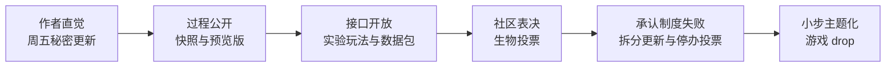

> **本章命题**：Minecraft 的版本更新真正争夺的从来不是「加什么内容」，而是由谁来定义「Minecraft 是什么」。

## 问题

2012 年，一个玩家说「我在玩 Minecraft」，指的是这样一款游戏：主世界的山只有几十格的起伏，下界是一个红色的、只有一种地貌的地狱，村民只能换几样没用的东西。2024 年，另一个玩家说同一句话，他面对的是从负六十多格的深板岩层一直延伸到三百二十格高空的世界、长着发光果实的溶洞、住着猪灵文明的玄武岩三角洲。两个人说的是同一个名字，内容量却完全不同。

按常理，内容更多的那个应该更「像 Minecraft」。可是只要在任何一个玩家社区里泡一天，你都会同时听到两种声音：老玩家说「这不是以前那个游戏了」，新玩家说「这就是 Minecraft 啊」。双方都不是在撒谎，也都不是在怀旧成瘾。他们争的是一个更根本的问题：当游戏本身一直在变，谁有权说「Minecraft 是什么」？

在 Notch 时代，这个问题有明确的答案：作者说了算。Notch 想加红石，红石就是 Minecraft；他想加一个终局维度，末地就进了游戏。2014 年微软收购 Mojang 之后，作者直觉退场，定义权出现真空。官方、老玩家、新玩家、主播、PvP 社区、模组作者都来填这个真空，而 Mojang 用了大约十年时间，搭出一整套制度来应对：快照、实验玩法、数据包、主题版本、生物投票、游戏 drop。

本章不写更新日志，只问一个问题：**官方如何与社区抢定义权？**我们把这十年间的几次大冲突——1.9 战斗更新、洞穴与山崖的拆分、历届生物投票——当成治理样本来解剖，看这套制度在哪些地方成功了，在哪些地方公开地失败了。

## 为什么系统更深了，仍有人觉得「不是以前那个游戏」

先承认一个反直觉的事实：这十年间，Minecraft 的系统深度只增不减。红石从一门小手艺长成了一套图灵完备的逻辑系统，生成算法从「随机撒点」进化成带气候与侵蚀模拟的地形引擎，末地与深暗之域补上了终局内容。按「内容多 = 更好玩」的朴素逻辑，抱怨应该越来越少才对。事实恰好相反。

原因在于：「这是不是 Minecraft」的判断标准，从来不是内容总量，而是**你入坑时的那个版本体验**。每个玩家心里都锚定着一个版本：2011 年年中之前入坑的人锚定的是连饥饿值都没有的 Beta 版，2014 年入坑的人锚定的是连点流战斗的 1.8，2022 年入坑的孩子锚定的是有深暗之域的 1.19。游戏每更新一次，就有一批人的「原点」被移走一些。当变化足够大——比如战斗规则被改写，比如地形推倒重来——被移走的人就会喊出那句话。

换句话说，这句话未必是怀旧滤镜。它常常指向具体的、可指认的改动：我的旧存档里那片生成机制已经被替换的地形，我练了十年的连点手法，我赖以为生的那个刷铁机。系统变深是真的，某些人的游戏被改动清零也是真的，两件事同时成立。

所以「不是以前那个游戏」这句抱怨，本质上是**定义权申诉**：我认可的那个 Minecraft，你凭什么替我改掉？在 Notch 时代，这种申诉没有制度化的出口，玩家只能发帖骂。Notch 走后，Mojang 必须回答一个新问题：一个没有作者的「作者」，如何面对一千万个自认有发言权的玩家？

这里有一个可以证伪的判断：如果玩家的不适感纯粹来自怀旧，那么新玩家中间就不该出现同样的抱怨。事实是每个版本的新玩家群体，在几年后也会用自己的方式维护「他们的」版本体验。执念会代际遗传，这恰恰说明它不是滤镜，而是定义权之争的结构本身。

## 共创接口：快照、实验玩法、数据包

Mojang 给出的第一个答案，是把开发过程本身变成接口。这个答案分三层。

第一层是**快照**（snapshot）。它是 Java 版特有的机制：每个正式版本发布之前，Mojang 把开发中的半成品按周发出来，任何人都能安装、游玩、报告问题。快照的编号是「年份 + 周数 + 字母」，比如 11w47a 意思是 2011 年第 47 周的第一个开发版——这也是历史上第一个正式按周编号的快照[^snapshot]。在此之前，Notch 并不是憋大招的人：2010 年的 Infdev 与 Alpha 阶段，他连发十个「周五秘密更新」（Seecret Friday Update），矿车、红石、船、地牢、钓鱼竿都是在几乎没有预告的情况下，某个周五直接出现在游戏里的[^seecret]。快照制度等于把「随手扔进来」的习惯正规化了：内容还是提前给玩家，但从「已生效」变成「可检验」。

为什么要在正式版之外发明快照？因为 Minecraft 的玩家基数里藏着全世界最大的测试团队，而且是最挑剔的那种——他们真的会沿着新地形走上几小时，真的会拿新机制搭建极端结构。与其等一年后让所有人在正式版里遭遇问题，不如把过程摊开，让最有意见的人在正式版之前就把意见说完。快照把「更新前的焦虑」改造成了「更新前的参与」。Bedrock 版的对应物叫**预览版**（Preview），逻辑相同：手机和主机玩家也能提前玩到开发中的版本。

第二层是**实验玩法切换**。有些改动太不稳定，连快照都不好意思放进去，Mojang 就给它们一个专门的通道。Java 版里，建新世界时可以勾选实验性开关——它的实现方式其实很直白：每个实验就是 Mojang 官方自带的、一个随游戏发行的数据包，勾选等于启用它[^datapack]。Bedrock 版里则是在世界设置里打开「实验」开关，代价写在脸上：开启实验的世界无法获得成就，而且一旦开启就不能关闭。

第三层是**数据包**（data pack）。2018 年的水域更新（Java 版 1.13）引入了它：一个数据包就是一组文件夹和函数，可以改战利品表、配方、进度、维度，甚至地形。它只存在于 Java 版，Bedrock 版的对应物是行为包（behavior pack）[^datapack]。数据包真正意味深长的地方在另一个事实里：**原版本体自己就是一个内置数据包**。战利品表、配方、进度，这些「原版内容」在技术上和玩家的数据包是同一种东西，躺在同一个位置。官方把「改游戏」的接口做成了游戏自身的构成方式——你写数据包不是在游戏外面挂东西，而是在官方内容的延长线上继续写。

这三层接口合起来，改变了官方与社区的位置关系。Notch 时代是单向广播：我做好，你玩。接口时代是流水线：新内容先经过快照上的公开检验，不成熟的部分锁在实验开关后面，而「原版」与「玩家改出来的内容」在技术形态上已经不可区分。这其实是把模组社区做了十多年的事情收编进官方流程——关于模组作者如何先于官方发明玩法，见[《模组作为第二作者》](/history/mods-as-authors)。

<Memoir title="抢跑的官方">

社区长久以来的一个固定节目，是拿快照里的新机制和热门模组对比：「这个洞穴生成，是不是有点像那个模组？」「这个新生物，官方版比模组版差远了。」这些对比大多无法证实，因为同一种玩法想象会在无数人脑子里同时出现。但方向是清楚的：玩家不再只问「官方加了什么」，而是拿整个模组生态当参照系，反过来评审官方做得到底好不好。官方对这种评审的回应方式，就是不断把共创接口往前推——与其被比下去，不如把比较的过程搬进自己家里。

</Memoir>

## 主题版本：下界更新、洞穴与山崖

接口解决的是「怎么改」，下一个问题是「改什么、怎么宣布」。Notch 时代的更新没有主题，只有一串新东西：这周五是红石，下周五是船。从 1.16 开始，Mojang 把更新包装成有名字、有主题、有宣言的事件。

2020 年 6 月 23 日发布的下界更新（Java 版与 Bedrock 版同为 1.16）是转折点[^nether]。它表面上加了很多东西：四个新群系、猪灵、下界合金、重生锚。但把清单读完你会发现，这次更新真正做的事是**重写一个维度的世界观**。此前的下界是一个功能性的惩罚空间——进去是为了挖石英、刷僵尸猪人攒经验，然后尽快出来。下界更新之后，它有了灵魂沙峡谷的萧索、诡异森林的异色、玄武岩三角洲的凶险，有了会跟你以物易物的猪灵，有了「穿上金甲才敢靠近」的生存规则。下界从一个关卡变成了一个可以住进去的地方。这是在宣示定义权：官方在说，下界「本来就该」是这样一个世界，以前那个红色走廊只是没做完。

真正把「生成系统当版本卖点」的是洞穴与山崖。这个更新分两次发布：第一部分（Java 版 1.17）在 2021 年 6 月 8 日，交出新方块与新生物；第二部分（Java 版 1.18）在 2021 年 11 月 30 日，交出真正的重头戏——主世界生成整体重做[^caves]。世界高度上限与下限大幅扩展，洞穴从细窄走廊变成奶酪洞、意面洞、面条洞三种尺度的地下空间，群系第一次按高度三维分布，矿山脉取代了均匀撒矿。值得注意的是，这次更新的主角不是新物品、新生物，而是「世界怎么长出来」这件事本身——官方第一次把底层生成算法当作发布会的主角，而且玩家真的为之沸腾。生成系统如何成为内容生产方式，[《世界生成即内容生产》](/design/worldgen)有专门讨论。

洞穴与山崖还有一个常被忽略的治理细节：**它本来不打算拆**。2021 年 4 月 14 日，Mojang 宣布把更新拆成两部分，官方给出的理由是内容量与复杂度超预期，以及团队健康[^caves]。到了当年的 Minecraft Live，深暗之域又被从这两个部分里划走，进一步推迟到 1.19。这是官方第一次如此公开地承认「我们做不完，而且累坏了」。放在任何一家游戏公司，这种公告都可能被当成事故；放在当时的 Minecraft 社区，它得到的更多是理解。因为快照制度早就教会了玩家一件事：看得到过程，就更容易接受过程中的调整。

主题版本是定义权的新形态。Notch 用周五更新说「游戏又多了点东西」，主题版本用两年周期说「Minecraft 现在是关于下界的游戏」「Minecraft 现在是关于地形的游戏」。每一次主题切换，都是官方对「这个游戏核心是什么」的一次重述。

## 「原版纯度」从何而来

现在来看玩家这一侧最奇特的景观：**原版纯度**（vanilla purity）。大量玩家坚持只玩「原版」——不开模组、不开作弊、不复制物品、不加任何改变玩法的修改，并以此自我标识。这个词在中文社区里对应「纯净生存」「原版生存」之类的标签。奇怪的地方在于：GTA、CS、Roblox 这些同样长寿、同样有庞大修改生态的游戏，都没有孕育出同等强度的纯度文化。为什么偏偏是 Minecraft？

第一层原因在游戏内部。Minecraft 的核心循环高度自足：没有任务清单，没有付费点，没有外部目标，深度全部来自约束——工具会坏、死亡会掉落、资源要手挖。约束如何产生深度，是[《约束即深度》](/design/constraints)的主题。纯度玩家守护的正是这些约束条件：一旦允许自己开创造模式拿东西，稀缺就消失了，成就感的基础也就塌了。纯度不是审美洁癖，而是对「难度才有意义」这条游戏内逻辑的自觉维护。

第二层原因在社区。模组成千上万，服务器各有各的规则，唯有原版是所有人共享的那份拷贝。玩原版意味着你练出的任何技术、发现的任何机制，对全体玩家有效、可交流、可比。一个红石机器在原版里能用，发到论坛上所有人都看得懂；放进某个模组包里，它就成了小圈子的方言。**原版是 Minecraft 世界的普通话**，纯度执念在很大程度上是维护这门普通话的执念。

第三层原因最讽刺：「原版」本身是移动的。1.9 改写了战斗，1.13 重做了水与命令，1.18 推平了地形。今天一个 2024 年入坑的玩家所坚守的「原版」，里面装着当年被无数纯度玩家痛骂过的每一次更新——攻击冷却、水域物理、新区块格式。守住的对象，被反对的过程不断改写。原版纯度与其说守着一个不变的物体，不如说守着一个不断移动的当前快照。

这个判断同样可以证伪：如果纯度只是「拒绝变化」，那么纯度玩家应该在每次更新时集体留守旧版本。可观察的事实是，绝大多数纯度玩家会照常升级到新版本，然后在新区本里继续不开作弊地活下去。他们拒绝的从来不是更新，而是**绕过游戏内约束的捷径**。

<Constraint name="原版契约" verdict="地基" chain="约束自足 → 全体玩家共享同一份规则 → 偏离约束即自断成就感 → 纯度成为社区默认契约">

纯度文化能自发的根本原因，是原版提供了一个无需任何人维护的公共契约：所有人都知道你没开挂，所以你的一切成果都可直接换算成荣誉。这个契约不需要服务器管理员、不需要模组加载器、不需要任何第三方担保——它就是「不装任何东西」这个零成本动作本身。

</Constraint>

## 投票与失败实验：治理替代作者直觉

定义权之争最激烈的地方，是「改了回不去」的核心机制。这里 Mojang 交过最昂贵的学费。

2016 年 2 月 29 日，Java 版 1.9「战斗更新」发布[^combat]。它引入了**攻击冷却**：每次攻击后有一段充能时间，冷却不满时伤害按比例衰减——满冷却才打满伤害，连点只会输出两成的伤害，此外还有盾牌、副手与横扫攻击。官方的设计判断是：连点是无脑的，节奏化战斗更有深度。PvP 社区的反驳同样成立：连点速度（每秒点击次数）正是他们练了六年的核心技艺，把技艺判定为「无脑」，等于宣布整个社区十年的积累无效。分裂由此开始，而且是结构性的：一整套「1.8 PvP」生态延续至今，主流 PvP 服务器至今仍运行 1.8 版本的旧战斗规则；Bedrock 版则从未跟进新战斗，两个官方版本从此各自保留一种战斗哲学。十年后的 2019 到 2020 年间，Mojang 又连发多个「战斗测试」快照，全部只在 Reddit 上发布，试图重做一套两边都能接受的战斗——最终整套方案没有进入正式版。一场更新的余震持续了十年，这是「官方定义权」撞上「社区既得技艺」的最大一次事故。

<Memoir title="留在 1.8 的人们">

在任何一个 PvP 服务器网络的版本投票帖里，你都能看到同一场辩论的重播：一派说旧战斗才是技术，一派说新战斗才是深度，中间是不断刷新的「怀旧党滚出去」。而服务器管理者的选择往往最诚实——把战斗切换做成服务器里的一个选项，让两个社区各玩各的。玩家的解决方案比官方的方案早了十年：既然定义权分不出胜负，那就分治。

</Memoir>

核心机制不能投票——那新内容呢？Mojang 选择了表决。生物投票（mob vote）始于 2017 年的 MINECON Earth，玩家从几个候选新生物里投出一个，其余的搁置。规模最大的一次在 2020 年 10 月 3 日的 Minecraft Live：候选是发光鱿鱼（会发光的鱿鱼）、冰术师（会扔冰块攻击玩家的灾厄法师）、哞花（身上长着花的奶牛）三选一，第一轮哞花以 28.3% 出局，决胜轮发光鱿鱼以 52.7% 对 47.3% 险胜冰术师，决胜轮有效票约 74 万张[^live2020]。这次投票把生物投票的全部矛盾暴露无遗：投票期间，当时最头部的几位主播公开为发光鱿鱼拉票，动员了数以千万计的观众，结果揭晓后，「流量绑架投票」的指责刷屏——批评者认为决定游戏内容的应该是玩法价值而不是主播的人头；辩护者的道理同样硬：投票本来就是一种动员，谁动员得起谁赢，这正是「社区投票」的字面含义。此后几届投票，几乎每一届都重演同样的分裂，连「落选生物何时加入」都成了长期的社区悬案[^mobvote]。

这场治理实验的终局颇有余味。2024 年 9 月，Mojang 宣布不再举办生物投票，理由是落选生物「没有被遗忘」，但投票本身持续制造社区对立[^mobvote]——一种参与机制因为参与成本太高而被关停，这在游戏史上不多见。同一年，官方把「一年一个大版本」的节奏改为**游戏 drop**（game drop，直译「投放」，指一次小型主题更新）：不再憋年度大更新，而是大致一个季度一次、每年三到四个主题小更新。这个体系在 2024 年 4 月随 Armored Paws（给狼加上盔甲变体的一个内容包）发布时被正式确认，此前 2023 年 12 月发布的一个小更新（Bats and Pots，蝙蝠与陶罐）被追认为第一个 drop[^gamedrop]。节奏变化的逻辑与投票停办一脉相承：年度大版本把全社区的期待压缩到一年一泄，期望落差与翻车风险都太大；小步快跑让每次「官方定义」的冲击变小，也让快照上的反馈更快转化为修正。

从 Notch 的直觉，到快照上的过程公开，到实验开关里的风险隔离，到投票里的正式授权，再到承认失败并退回小步迭代——这条链路就是 Mojang 用十年时间给出的答案：**定义权无法被任何一方独占，那就发明让各方轮流持有的制度**。这套制度当然不完美：投票会被人头绑架，快照会泄露剧透，实验玩法会养出永远出不了实验室的功能。但它把一场本来会撕裂社区的战争，变成了一系列有规则的回合。关于规则由谁制定这个更一般的问题，[《规则由谁制定》](/design/who-makes-rules)会从玩法规则的角度再问一遍。

## 这一章留下什么

- **爱好者**：下次想喊「这不是以前的 Minecraft」时，先想想自己锚定的是哪个版本——以及是否愿意让别人锚定他们自己的那个。
- **开发者**：能抄走的是把开发过程做成共创接口——快照公开过程、实验开关隔离风险、数据格式让「本体」与「扩展」同构；抄不走的是这一切的前提：玩家基数大到能自我组织，否则参与只是噪音。

[^seecret]: Minecraft Wiki，《Seecret Friday Updates》，minecraft.wiki，检索于 2026-09-18；见 https://minecraft.wiki/w/Seecret_Friday_Updates

[^snapshot]: Minecraft Wiki，《Snapshot》（首个按周编号快照 11w47a 及命名规则），minecraft.wiki，检索于 2026-09-18；见 https://minecraft.wiki/w/Snapshot

[^combat]: Minecraft Wiki，《Java Edition 1.9》（战斗更新，2016-02-29 发布；攻击冷却、盾牌、副手），minecraft.wiki，检索于 2026-09-18；见 https://minecraft.wiki/w/Java_Edition_1.9

[^nether]: Minecraft Wiki，《Nether Update》（Java 版与 Bedrock 版 1.16，2020-06-23 发布），minecraft.wiki，检索于 2026-09-18；见 https://minecraft.wiki/w/Nether_Update

[^caves]: Minecraft Wiki，《Caves & Cliffs》（第一部分 Java 版 1.17 于 2021-06-08、第二部分 Java 版 1.18 于 2021-11-30 发布；2021-04-14 官方宣布拆分，理由含内容复杂度与团队健康），minecraft.wiki，检索于 2026-09-18；见 https://minecraft.wiki/w/Caves_%26_Cliffs

[^datapack]: Minecraft Wiki，《Data pack》（Java 版 1.13 经快照 17w43a 引入，Java 独有，Bedrock 对应物为行为包；原版本体以内置数据包定义，实验功能以内置数据包启用），minecraft.wiki，检索于 2026-09-18；见 https://minecraft.wiki/w/Data_pack

[^live2020]: Minecraft Wiki，《Minecraft Live 2020》（2020-10-03 举行；生物投票第一轮哞花获 28.3%，决胜轮发光鱿鱼 52.7% 对冰术师 47.3%，决胜轮票数 741,145），minecraft.wiki，检索于 2026-09-18；见 https://minecraft.wiki/w/Minecraft_Live_2020

[^mobvote]: Minecraft Wiki，《Mob Vote》（2017 年 MINECON Earth 首届；历届胜出者与落选者；2024-09-09 宣布停办），minecraft.wiki，检索于 2026-09-18；见 https://minecraft.wiki/w/Mob_Vote

[^gamedrop]: Minecraft Wiki，《Game drop》（体系于 2024-04-23 随 Armored Paws 发布确认；2023-12-05 的 Bats and Pots 被追认为首个 drop；每年三到四个），minecraft.wiki，检索于 2026-09-18；见 https://minecraft.wiki/w/Game_drop
