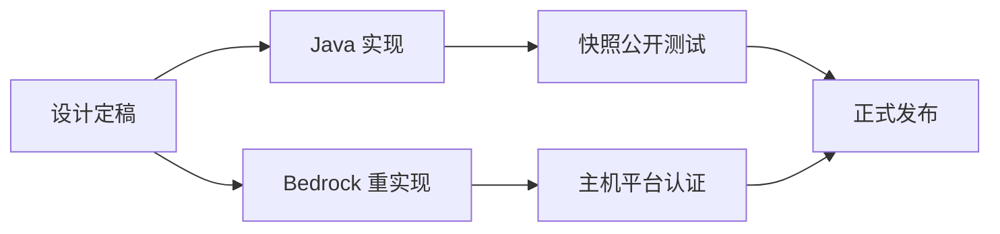

> **本章命题**：Bedrock 不是 Java 版的移植，而是一次平行重写；平行重写最致命的代价不是性能差距，而是语义分叉——同一张图纸、同一份教程、同一个世界，在两边不再指同一件事。假如两版的差异只停留在快慢而规则处处一致，本命题即告失败。

## 问题

在 Java 版社区流传多年的某张红石图纸，画的是一扇活塞自动门：信号从斜上方一格「隔空」引过来，省掉一段红石线。Java 版玩家照着盖，门开了。Bedrock 版玩家照着盖，门纹丝不动——不是慢半拍，是永远不会动。他逐格核对布局，全都没错；错的是「图纸」这个词背后预设的前提：两边玩的是同一个游戏。

这类事故不止于机关。两个版本的玩家至今无法直接联机；把世界文件夹从一边拷到另一边，游戏打不开；Java 服务器圈流行的战斗连招，搬到 Bedrock 里不但无用，反而是坏习惯。如果 Bedrock 只是「跑得慢一些的 Minecraft」，以上事情一件都不该发生——慢，是可以适应的；不一样，是知识直接作废。

本章要回答的问题正在这里：**语义差异为什么比性能差异更致命？**展开之前先厘清一段公案——Bedrock 这个名字，迟至 2022 年才成为官方叫法[^bedrock]。2017 年秋天那次大更名里，全平台合流的新版直接叫「Minecraft」，不带任何后缀；反倒是资历最老的 Java 版，从那天起挂上了「Java Edition」的后缀。谁更像「本尊」，官方已经用命名投过一次票。而本章只关心实现：那个不带后缀的版本，究竟是怎么造出来的。

## 另一次实现不是移植

先分清两个词。**移植**，是把同一份代码搬到新环境里跑：代码本身就是规则的载体，规则跟着代码走，走到哪里都不变形，变的只是它跑多快。**平行重写**，是用另一种语言把同一套规则重新表述一遍：每条规则都要重新讲一次，讲错的可能出现在每一条上——你甚至会在重新表述时发现，原实现里有些「规则」根本是意外，是原实现的毛病长成了世界规律。

Bedrock 走的是第二条路。它的前身是 2011 年 8 月上架安卓的携带版：那个年代的手机装不下 Java 虚拟机，苹果的手机从头到尾也不允许，于是只能用 C++ 从头写一遍[^bedrock]。这份代码后来长成一套覆盖手机、Windows、Xbox、PlayStation、Switch 的公共内核，维基条目对此毫不含糊：它不是 Java 代码的移植，是另一套代码库，只是奔着同样的游戏目标去——生存、下界、末地，目标相同，表述各异。

「另一套表述」不是修辞。同一条游戏规则——比如「红石火把会给相邻方块供能」——在两套代码里是两段不同的程序，各自读取输入、各自维护状态、各自决定何时响应变化。绝大多数时候两边行为一致，因为规则的本意相同；分歧藏在规则的暗处：没写进任何文档的边角行为、更新顺序的微妙约定、数值精度的取舍。移植不会碰这些暗处，因为代码原样在跑；重写则处处都是暗处，因为每一段都要重新作答。两个版本这段历史如何分合、商业上如何取舍，[《两条产品线：Java 与 Bedrock》](/history/java-bedrock)已经讲过；本章接着讲那次分岔在技术深处留下了什么。

本节也给命题留一个可检验的出口：假如 Bedrock 真是移植，两版差异就该只出现在速度与画面上。后文的分叉表将说明，差异长在规则内部。

## 技术栈与扩展模型

Bedrock 的基本盘，是用一套 C++ 代码库覆盖所有平台：同一份游戏逻辑按平台分别编译，图形、输入、存储各走各的系统接口，一次更新几乎同时推给手机、电脑与各家主机。节奏的节拍器是主机认证——每个版本都要过平台方的审核。这既是约束（本章末节会回到它），也带来一个真实的好处：全平台玩家几乎永远在同一版本上。

<Alternative title="每个平台各写一份的老路">

在 Bedrock 之前，主机上的 Minecraft 是按平台各做一份的独立实现，由外部工作室分别开发，几个主机版之间也互不相通。那是「每个平台一份实现」的路线：每多一个平台，规则就多出一个变体。Bedrock 用「一份实现、所有平台」取代了它——跨平台联机正是这份统一的直接红利。分合的历史细节见双版本史一章，此处只看实现层的得失。

</Alternative>

渲染这一层，Bedrock 在 2019 年到 2021 年间整体换装。新引擎叫 RenderDragon——用白话说，渲染引擎就是游戏里负责「把方块世界画到屏幕上」的那一层程序，与游戏规则的代码互相独立。它 2019 年 6 月被开发者首次公开，随增强现实手游 Minecraft Earth 的封测第一次上线，随后分批铺进 Bedrock 各平台：Windows 正式版从 1.16.200 起附带光线追踪选项，主机与移动端到 1.18.30 前后完成换装[^renderdragon]。换装的意义不在画面本身，而在架构：渲染从此是一条与规则代码分开的独立路线，可以单独演进——Windows 上能开硬件级光线追踪，低配设备走低配渲染路径，后来的 Vibrant Visuals（官方的画面升级方案）也先在 Bedrock 落地——而世界规则那层代码不必跟着动。

真正塑造生态的是扩展模型。它分三层，能力递进：

**资源包**管外观：贴图、模型、音效、界面，只改「世界看起来什么样」，不碰「世界怎么运转」。**行为包**管规则：用 JSON 文件——一种键值成对的结构化文本——定义生物的行为、掉落物、刷怪条件、配方、生物群系；作者不写传统意义上的代码，而是填官方预设的组件参数，运行时的数值表达则交给一种叫 Molang 的小语言。**脚本 API** 管逻辑：在包里放 JavaScript 代码，通过官方模块读写世界、监听事件、跑自定义循环；想用哪个模块、哪个版本，必须在包的清单文件 manifest.json 里声明成依赖，游戏按声明加载[^addon]。这套脚本能力多年前就有雏形，家族里最老的模块本来是给自动化测试用的；如今的第二版脚本 API 已经能注册自定义组件与自定义命令[^scriptapi]。

把 Java 的扩展方式放在旁边对照，两条路线的取舍立刻显形。Java 模组是把编译好的代码注入游戏进程，能摸到哪里只受加载器限制，能力近乎无限；代价是每个平台、每个加载器版本都要重新适配，而且玩家得运行未经官方审核的第三方代码。Bedrock 把扩展关进「数据定义加脚本沙箱」：接口没暴露的就做不到；换来的是同一份附加包从手机到主机不用改一行，也不存在任意代码执行的风险。这不是纯粹的技术偏好，而是平台约束的直接产物——主机平台根本不允许游戏加载任意外来程序。

<Constraint name="扩展边界的立法" verdict="地基" chain="主机认证禁止任意原生代码 → 扩展被限制在数据定义与脚本沙箱 → 能做什么等于官方接口的暴露面">

沙箱不是能力的天花板画得比 Java 低那么简单：它把「能做什么」的决定权从社区手里收回到接口设计者手里。Java 模组作者缺什么就自己造什么，Bedrock 作者缺什么只能等官方暴露什么。

</Constraint>

## 语义分叉表

下面这张表，每一行都是玩家可观察的行为差异——不是跑分，不是玄学。它们共同回答一个问题：当两套实现各自表述同一套规则时，分歧落在了哪。

| 行为 | Java 版 | Bedrock 版 | 对玩家意味着什么 |
| --- | --- | --- | --- |
| 活塞的「准连接性」 | 活塞、发射器、投掷器会被其正上方一格空间的信号激活，哪怕信号没有接触元件本身——官方按特性保留此行为 | 无此行为，信号必须作用到元件自身 | Java 教程中一整个门类的机关（隔空供能的侦测装置、省红石线的布线技巧）在 Bedrock 上不是变慢，而是永远不会触发 |
| 攻击判定 | 2016 年起伤害随蓄力衰减，连续点击只打得出两成伤害，剑附带横扫 | 无蓄力机制，连续点击伤害不打折 | 两边的走位节奏、武器强弱排序、手感记忆互不通用；Java 练出的「等蓄力」节奏在 Bedrock 里纯粹是浪费输出 |
| 世界文件 | Anvil 区块格式，多个区块打包存进区域文件 | 改造版 LevelDB 键值数据库，打开世界文件夹能看到成堆的数据库文件 | 世界不能直接互拷；社区转换工具存在，但复杂世界转过去总有东西出错，精细工程基本必坏 |
| 随机刻范围 | 作物等随机生长跟随加载的区块；1.18 起有「模拟距离」设置，默认 12 区块、最大 32 | 模拟距离默认 4 区块、按曼哈顿距离计算；范围外作物与矿物停止随机生长 | 同一张挂机农场图纸，Bedrock 上产能骤降甚至停摆；农场尺寸必须按版本重新设计 |
| 生物生成与清除 | 生成与清除以固定半径为准，远离约 128 格的生物立即消失 | 与模拟距离挂钩：默认档位下 44 格外即消失，生成窗口也窄得多 | 刷怪塔的高度、挂机点位、效率估算要按版本各算一遍；「我的塔为什么不刷怪」的答案两边不同 |
| 红石元件时序 | 活塞、侦测器、漏斗的更新顺序自成体系，存在一刻之内瞬间脉冲的高级技巧 | 另一套更新时序，瞬间脉冲的行为不同 | 依赖时序的高级红石不可复用；纯导线、火把这类低速电路两边倒还大体通用 |

第一行值得多说一句，因为它最能说明「语义分叉」是怎么回事。准连接性的成因，是 Java 版里「方块更新」的传播范围和「供能判定」的检查范围不一致：更新能传到两格之内，供能判定却会看向正上方一格的空间——活塞于是能被一个它自己「感觉」不到的信号激活[^qc]。这个行为最初是实现上的意外，社区围绕它盖起了整整一类建筑，官方最终把它登记为「按预期工作」。Bedrock 的实现没有这个意外，于是也没有这类建筑。注意因果方向：不是 Bedrock 砍掉了功能，而是**两套代码各自长出了自己的意外，其中一方的意外成了另一方的规则盲区**。红石系统的完整分析见[《红石：把物理做成编程》](/design/redstone)。

表里其余几行也各有出处可查：蓄力衰减机制是 2016 年 2 月的 Java 1.9 定下的，连点只打出两成伤害[^combat]；模拟距离的默认值、生物清除的判定距离，两版参数差异都有据可查[^simdist]。

<Note>分叉不是单向的：Bedrock 也长出了 Java 没有的东西（比如源自教育版的化学玩法内容）。两版各自演化，谁也不是谁的子集。</Note>

现在可以正面回答本章的问题了：**为什么语义差异比性能差异更致命？**

第一，性能差异是「程度」问题，语义差异是「对错」问题。帧数低、加载慢、机器发烫，玩家的知识依然成立——同一座刷怪塔照样工作，同一条挖矿路线照样富矿，只是体验打折。语义分叉则让知识本身失效：教程没有变慢，它变假了。拿着 Java 图纸的 Bedrock 玩家不是「体验不佳」，而是被错误信息引导。

第二，这个游戏流通的主要商品是规则知识。Minecraft 没有强制路径，玩家之间真正传递的是「怎么玩」：教程视频、维基条目、图纸、肌肉记忆。性能差距磨损的是单次体验；语义差距磨损的是这个知识市场——每份知识都得标明版本，或者干脆写两份，整个攻略生态背上永久的双份维护税。

第三，性能问题有标准的缓解手段——换设备、调画质、加内存——而语义差异无法配置。设置菜单里没有任何一项叫「开启准连接性」；Java 版的愚人节快照里倒是出现过投票关闭准连接性的选项[^qc]，这恰恰说明它属于规则层，不属于性能层。你的硬件再好，也买不到另一个版本的规则。

第四，语义分叉是静默的。性能问题三秒内就能感知——画面卡了；语义问题要等机关盖完、农场跑空之后才显形，而且界面上不会有任何提示写着「此版本行为不同」。它伏击在每一次搬运知识的路上。

这个判断也写明了怎样算它错：假如分叉只存在于深水区机关、从不波及核心玩法，「致命」就是夸张——但攻击判定与农场产能恰恰在核心玩法上；假如社区能把差异的迁移成本降到近零（教程自动改写、参数自动换算），致命性同样消解——现实是每份教程都得人工标注版本；假如性能差距大到同一台设备根本无法游戏，性能会重新成为主要矛盾——现实是流畅恰恰是 Bedrock 真实的长项。

## Marketplace 的反向约束

Bedrock 内置一个官方策划的内容商店 Marketplace。它的商业与分账面目归双版本史一章，这里只看一件事：**审核如何反过来塑造创作**。商店内容由官方合作计划的成员提交，逐件通过官方内容团队的审核后上架[^marketplace]。

这件事有一段前史。商店出现之前，主机平台的可下载内容要分别通过各平台的认证——同一件作品，微软、索尼、任天堂各审一遍。商店的初衷之一就是替创作者消掉这道重复工序：上架一次，全平台发行。渠道的统一由此反过来定义了内容的最优形态。

于是模具开始塑造浇进模具里的东西，至少体现在三处。

其一，类别即能力边界。商店的类目里，材质包只许改观感——贴图、音效、界面、动画，不许新增生物、方块、物品；要加内容，必须走附加包类目[^marketplace]。作者想卖「新怪物」，作品就得先长成官方定义的「附加包」形状。

其二，许可改写商品形态。2024 年 2 月之前，附加包不能单独售卖，必须和世界捆绑出售[^addon]——于是商店里长年以「世界模板」为主力卖法。不是作者都爱做整张世界，是格式许可只开了这道门。

其三，渠道即边界。主机上无法导入从外部网站下载的附加包，外部内容只能装进手机与 Windows 版[^marketplace]。主机玩家的全部可玩内容就是商店——不是技术做不到，是渠道不开放。能力的执行点从代码挪到了柜台。

三处合起来，就得到「反向约束」的准确含义：审核制的作用不是「过滤坏内容」，而是**「能上架的格式」决定「作者先做什么」**。当发行要求内容照顾最弱设备、通过内容团队审核、以规定类目呈现时，创作者的构想从立项那一刻就在模具里成型。超出模具的东西不是被拒绝——是根本不会被做出来，或者只能做进免费的社区渠道。对照 Java 那边：能力边界由技术定义，加载器能注入什么就有什么，分发没有审核与门槛。同一个「能被再开发的系统」，两边的立法权不同：Java 版的立法权在社区的技术能力手里，Bedrock 版的立法权在接口设计者与审核流程手里。

<Constraint name="内容边界的立法权" verdict="凑合" chain="主机认证挡住任意原生代码 → 沙箱接口成为唯一通道 → 审核与类目再把边界收窄为可上架的子集">

说它是「凑合」，是因为这是用创作自由换发行范围的一笔交易，而不是唯一解：接口与审核本可以更开放，跨平台安全由别的方式兜底。

</Constraint>

这个判断同样可证伪：假如「沙箱之外无内容」是 C++ 或沙箱的技术必然，商店就该永远无法接受更开放的形式——而附加包事实上已经能新增自定义生物、方块乃至脚本游戏循环，可见审核收紧的那一层是政策选择，叠在技术约束之上，而不是技术约束本身。

## 两个游戏的工程现实

官方维持两套实现，意味着每个新特性都要走两遍：设计定稿之后，一侧先实现，另一侧重实现。起草侧因特性而异——玩法特性多在 Java 快照里公开打磨，画面特性则先在 Bedrock 落地；但无论谁先走，另一侧都不是「复制」，而是在另一套引擎里把同样的规则重新做一遍，还要避开那套引擎自己的全部时序陷阱。

一致性本身是一项持续的工种。版本说明里长期保留着「与另一版本对齐」一类的条目——官方把它们当作日常任务，而非一次性清偿的旧账。工程含义很直白：**任何一边的自由改动，都是另一边的对齐债**。一边为了手感或性能调整了一个数值、一处时序，另一边就得决定跟不跟：跟，可能破坏自己这边长出来的生态——那些依赖本地意外的机关与农场；不跟，分叉表就又多一行。这不是哪支团队偷懒，是平行重写的结构性成本。

社区则在替双方支付翻译成本。维基几乎每个机制页面都分 Java 与 Bedrock 两栏；每份教程都要标明版本；世界转换工具在两套存储格式之间搬运数据（存储的底细见[《存储与序列化》](/impl/storage)），覆盖不全、边缘情况不断；甚至有社区项目专门做协议翻译网关（如 Geyser），让 Bedrock 客户端能连上 Java 服务器——官方没有给的互通，玩家自己搭了一层。逐项对照差异是附录的职责：见[《Java / Bedrock 对照表》](/appendix/java-bedrock)。

回到总命题。换语言重写之后，分叉长成了两个游戏。它们共享一个名字、一个品牌、一部分服务器与注意力市场；但代码是两套，规则细节是两份，扩展的立法是两种。「Minecraft 是一套能住进去、能玩出设计之外、还能被再开发的系统」——这句话在两个版本里各有一个答案：Java 版回答「能，边界由社区的技术能力画」；Bedrock 版回答「能，边界由官方接口与审核画」。两个答案都对，两个游戏都活着。这就是「另一次实现」的全部重量：它没有造出一个更好或更差的 Minecraft，它造出了第二个 Minecraft——连同第二套规则、第二种自由、第二笔生态账。

## 这一章留下什么

- **爱好者**：搬教程、搬机关、搬世界之前，先问一句「这是哪个版本的知识」——差异不在快慢，在规则本身。
- **开发者**：能抄走的是扩展模型——数据定义加脚本沙箱、清单声明依赖版本，一份扩展跑遍全平台的思路；抄不走的是审核制商店与多平台认证铺出的渠道——那是用创作边界换发行范围的交易，只对愿意签这份合同的人生效。

[^bedrock]: Minecraft Wiki，《Bedrock Edition》（C++ 独立代码库、非 Java 版移植；2017-09-20「相聚更新」统一命名；「Bedrock Edition」2022-06-07 起为官方名称），minecraft.wiki，检索于 2026-09-18；见 https://minecraft.wiki/w/Bedrock_Edition

[^renderdragon]: Minecraft Wiki，《RenderDragon》（2019-06-20 首次公开、随 Minecraft Earth 封测上线；Windows 正式版 1.16.200 附带光线追踪，主机与移动端至 1.18.30 前后铺开），minecraft.wiki，检索于 2026-09-18；见 https://minecraft.wiki/w/RenderDragon

[^addon]: Minecraft Wiki，《Add-on》（资源包、行为包、脚本三层；脚本模块须在 manifest.json 声明依赖；2024-02-20 起附加包可单独上架），minecraft.wiki，检索于 2026-09-18；见 https://minecraft.wiki/w/Add-on

[^scriptapi]: Minecraft Wiki，《Script API》（JavaScript 与 TypeScript；@minecraft/server-gametest 为最老模块、源自自动化测试；第二版 API 新增自定义组件与自定义命令），minecraft.wiki，检索于 2026-09-18；见 https://minecraft.wiki/w/Script_API

[^qc]: Minecraft Wiki，《Quasi-connectivity》（准连接性仅存在于 Java 版与旧主机版；Mojira 判定 MC-108 为「按预期工作」；成因是方块更新的传播范围与供能判定的检查范围不一致；Java 愚人节快照 23w13a_or_b 曾提供关闭选项），minecraft.wiki，检索于 2026-09-18；见 https://minecraft.wiki/w/Quasi-connectivity

[^combat]: Minecraft Wiki，《Java Edition 1.9》（2016-02-29 发布；攻击蓄力条按 20%–100% 二次衰减、剑附带横扫、新增副手），minecraft.wiki，检索于 2026-09-18；见 https://minecraft.wiki/w/Java_Edition_1.9

[^simdist]: Minecraft Wiki，《Simulation distance》（Bedrock 默认 4 区块、按曼哈顿距离计算，模拟距离 4 时 44 格外生物立即消失；Java 版该设置于快照 21w38a 加入、默认 12、范围 5–32），minecraft.wiki，检索于 2026-09-18；见 https://minecraft.wiki/w/Simulation_distance

[^marketplace]: Minecraft Wiki，《Marketplace》（内容由合作伙伴计划成员提交、官方内容团队审核；上线前各平台可下载内容需分别认证；主机不可导入外部附加包），minecraft.wiki，检索于 2026-09-18；见 https://minecraft.wiki/w/Marketplace
