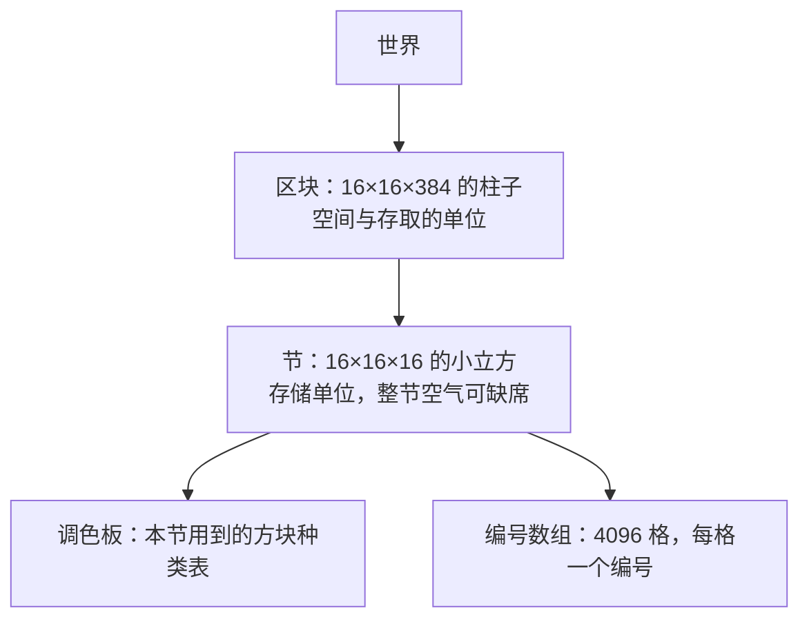

> **本章命题**：Minecraft 的世界不是一张画好的地图，而是一本逐格记账的账本——玩家看得见的规则，从「世界按块加载」到「高度有上限」再到「空处也是方块」，都是这本账本的账面结构决定的。若空气不占任何数据、高度上限只是随手可拨的滑块，本章的判断就不成立。

## 问题

走进一片新地形时，你见过世界是怎么出现的：不是一整张画卷徐徐展开，而是一根一根方块柱子从雾里立起来。按住 F3，屏幕上滚过一串以 chunk 开头的数字——世界确实是被切成一块一块管理的。还有一件事你可能没想过：从海平面向上盖房，盖到某一层就再也放不下方块。1.18 之前，这一层是第 255 层；1.18 之后，世界向下挖到 -64 层、向上盖到 319 层，总高从 256 格变成 384 格[^height]。

把这三件玩家都摸得到的事放在一起，问题就浮出来了：世界凭什么要分块？什么都没有的地方，凭什么也要记一笔账？往上垫方块，为什么会撞上一块「天花板」——而且撞了十几年，官方才在一次大更新里把天花板抬高？

这一章把世界拆到最小的记账单位，正面回答两个问题：**空气为什么也是数据？区块到底意味着什么？**回答清楚之后，「改一次高度为什么算大事件」会自己浮现出来。

## 玩家看到的方块 vs 内存里的方块

玩家心里的世界模型很简单：每个位置，要么有一个方块，要么没有。挖掉矿石，那里就「没有了」。

机器里的模型多了一条铁律：**每个位置必须有一个答案，而答案永远是一种方块。**「没有」不在词表里。你挖掉矿石后，那个位置记录的是空气——空气是一种和其他方块地位完全相同的方块，在 Java 版数据里有自己的名字 minecraft:air，照样有编号、照样占一条记录。

为什么必须这样？因为「这格是什么」是游戏每秒钟要问几万次的问题：光要穿过谁，水往哪里流，生物能不能站在这，这面墙要不要画出来。问答机制要求每个位置都接得通。如果允许「没有答案」，游戏就得再养一套簿记，去区分「还没存」「还没算」「确定是空」——省下的一条记录，换来一整套特例。Minecraft 的选择是笨办法，也是好办法：每格都记，空也记。

第二层错位更隐蔽。玩家说「一个方块」时，指的是一个完整的东西，比如一台熔炉；机器里它至少拆成两笔账——一笔记这台炉子朝哪边（轻，随时整批读写），另一笔记炉膛里烧到第几步（重，随内容变化）。第一笔叫方块状态，第二笔叫方块实体，下一节展开。

先把全章的账目对齐。玩家嘴里的一句话，落到账本上是哪一条：

| 玩家看到 / 说出 | 账本里对应的条目 |
|---|---|
| 一格石头 | 一条方块状态：种类是石头，没有额外属性 |
| 一格朝北的橡木楼梯 | 一条方块状态：种类是橡木楼梯，属性「朝向 = 北」 |
| 「这里什么都没有」 | 空气——一种普通方块，照常占一条记录 |
| 箱子里的三组物资 | 不在方块本身，在方块实体（附加档案）里 |
| 脚下加载出来的一块地 | 一个区块：横向 16×16、纵向贯穿全高的数据柱 |
| 高度上限 | 数据模型的尺寸参数：这本账每列记多少行 |
| 掠过的僵尸 | 不是方块——另一套实体数据（卷三第 6 章单独分家） |

后面四节，就是把这张表一行一行讲透。

## 方块状态、元数据、方块实体

**方块状态**是一块方块的属性清单。打个比方：每种方块都挂一块铭牌。石头的铭牌上只有名字；楼梯的铭牌上要填空——朝向哪边、在上半还是下半、有没有被水淹。属性不多，每样只有固定的几个档位，这正是它「轻」的原因：整条街的铭牌格式统一，可以一口气抄完。

这套铭牌不是一开始就有的。**1.13 之前，属性没有名字，只有一个数字。**每种方块除了种类编号，只带一个 0 到 15 的「数据值」——4 个二进制位，16 个名额[^datavalues]。羊毛的 16 种颜色恰好用满；木头的「竖着放还是横着放」要占几个名额；到了楼梯，4 个朝向乘以上下两种，8 个名额没了，再想加「含水」？对不起，没有名额了。更麻烦的是语义：同一个数字，在羊毛那里是红色，在木头那里是东西向——每种方块自说自话，谁也不认识谁家的户口本。

2018 年年中发布的 1.13 做了一次大扫除，官方称为「扁平化」：把「种类编号 + 数字」压平成「一种方块一个名字，属性显式列出」[^states]。方块状态从此进入存档、命令和模组接口。代价不小：属性组合让方块种类数暴涨，全部旧存档要逐格迁移。收益同样实在——「含水」在 1.13 作为普通属性挂上楼梯和栅栏，在旧体系里这需要从别人手里抢名额；地图与模组作者从此不必背诵「数据值 15 在某方块里是什么意思」的口诀。

**方块实体**处理铭牌装不下的东西。箱子的 27 格物品栏、告示牌上的文字、熔炉里烧到一半的进度——这些东西长度不定、结构复杂。硬塞进方块状态？那「放着一组圆石的箱子」和「放着两组泥土的箱子」就成了两种方块，账本立刻爆炸。Minecraft 的解法是分家：方块本体照常占一格，旁边挂一个档案袋，也就是方块实体[^be]。档案袋用一种叫 NBT 的格式写——一种带标签的树状数据，像每张卡片自己填好字段名的档案，随存档落盘。

<Note>告示牌是方块实体最直观的例子：街上两块告示牌，方块状态完全相同，写的内容可以完全不同——因为文字住在档案袋里，不写在铭牌上。</Note>

档案袋不是免费的。方块状态格式统一，可以整列整批地读写；方块实体是散落各处的独立对象，游戏要一个个单独追踪——熔炉要自己烧，箱子要记得自己装了什么。玩家熟悉的规则差异由此而来：Java 版里活塞推得动石头，却推不动箱子——活塞只搬得动铭牌，搬不动档案袋，碰上箱子只能把它砸碎、让里面的东西掉出来。Bedrock 版的活塞可以推动箱子，两版在这里分了叉[^be]。

于是有一条清晰的判据，你自己设计体素游戏时可以直接拿去用：**取值有限、影响外观的属性，住在方块状态里；取值不定、结构复杂的附加数据，住进方块实体。**哪天你看到「箱子里的内容」被塞进了方块状态，这个体系就是设计错了——种类数会跟着内容组合无限膨胀。

## 区块、节、调色板、压缩

**区块**是横向 16×16、纵向贯穿全高的一根数据柱。世界为什么要按柱子切？因为加载、保存、生成、发送，都需要一个基本单位：玩家沿地面移动，游戏要补的是「以我为中心的一圈柱子」。切太碎，管理开销盖过内容；切太大，一次读写太多。16 是折中出来的工程数。

所以「区块意味着什么」的完整答案是：它是**一串身份的叠加**——空间单位（一块地）、存取单位（存盘读盘按柱来）、生成单位（第 3 章的流水线按柱开工）、网络单位（发给客户端按柱打包）。玩家在游戏里能亲眼验证这个切分：按 F3 + G，世界的区块边界会以线框显形；走进新地形时的逐块浮现、跨区时的那一声卡顿，都是这根柱子在被生产、被搬运的瞬间。这根柱子甚至能替你值班：Java 版里出生点周围的区块常年保持加载，你下线之后，那片地里的农场和熔炉还在运转——值班的就是区块，不是魔法。

一根柱子从海底立到天顶，混着实心与虚空，于是再竖着切一刀：**节（section）**，16×16×16 的小立方，世界真正的存储单位。1.18 之前一根柱子是 16 个节，扩到 384 格高之后是 24 个[^chunk]。切节的全部意义在于偷懒变得有章法：**整节都是空气的节，干脆不存。**读取时，「没有这一节」被翻译成「这一节全是空气」。这是空气「既是数据、又不必总占数据」的机关——它在账本上有一席之地，但整页空白时可以整页省略。

省空间的第二个机关是**调色板**。节内每格不存方块的完整名字，只存一个编号，编号指向一张本节的「种类表」——就像画家的调色板：先把这幅画用到的几种颜色摆好，画布上只记「第几种」。一节 4096 格；若整节只有石头和空气两种，每格只需 1 个比特，整节 512 字节；种类变多，位数跟着涨——两种 1 位，十六种 4 位——但涨幅按「种类数的倍增」走，不按方块数走。关键在「本节」二字：调色板是每节独立的，这一节里没出现的方块，不占这一节的表。

<Impl title="位打包">编号不按字节对齐，而是背靠背挤进一串 64 位整数：两种方块时一格 1 位，一个 64 位整数装下 64 格。这套「调色板 + 位打包」是现代 Minecraft 的底层共识——硬盘上的存档、内存里的世界、发给客户端的网络包，用的都是同一套思路。你不必抄它的每一个常数，但「先查表、再记编号」这个动作值得抄。</Impl>

最后还有第三层：数据落盘前再做一遍通用压缩。两层分工明确——调色板消灭「重复内容的重复记录」，压缩消灭「剩下数据里的重复模式」。一个普通存档里，一千块石头搭的建筑占的字节，可能还没有你家一个分类仓库多——就是这两层一起干的。

本章以 Java 版的世界格式为主线。Bedrock 版的世界装在 LevelDB 键值库里，切块与调色的思想相通，实现细节分了叉——那条产品线怎么分的手，第 8 章已经讲过（见[《两条产品线》](/history/java-bedrock)）。

## 稀疏与稠密

世界在两个方向上的命运完全不同。纵向有限：384 格，一列从底记到顶，算得清、养得起——**纵向稠密**。横向近乎无限：没有谁存得下一张完整地图，所以只有你去过的地方才有数据，没生成的区块不是「空白」，是「不存在」——**横向稀疏**。

往下一层，还有一对稀与稠。**节间稀疏**：天上的节整节缺席；**节内稠密**：一个节只要存在，4096 格就全部记录——哪怕其中 4095 格是空气，只为独守一根火把。这根火把享受的不是浪费，是最热路径的速度：光照、碰撞、寻路、生成，全都在问「按这个坐标，这格是什么」，答案必须一步到位。稠密数组（每格编号等长排列）保证了一问一答不用查表跳转；调色板已经把每格的代价压到几个比特；此时改用「只记例外」的稀疏结构，省下的空间买不回变慢的读取——何况地下世界大多实心，例外并不比寻常少。这不是「越省越好」的设计，是「在最常发生的事情上最快」的设计。

<Alternative title="只存种子和玩家的改动">另一种常见设计是「种子 + 改动清单」：世界每次从种子现场生成，只叠加玩家改过的格子，文件可以小到极致。Minecraft 对未生成区块等效地用了这个方案——不存在就不占空间；但对已生成区块选择全量落盘：生成过的地连同原样一起存。多占的空间，换来两样东西：读取时不必再求助于生成器（生成器改版也动不了你的旧宅子），以及高频随机读永远走最短的路径。这笔账在下一章（存储与序列化）接着算。</Alternative>

现在可以正面收束本章的第一个问题了。**空气为什么也是数据？**三个理由叠在一起：其一，每格必须有答案，空气就是那个答案；其二，「没存」不等于「是空气」——「这一节不存在」的意思是「从未生成」，不是「确定是空」，一旦生成，空气就老老实实进调色板；其三，空气参与一切规则——光照穿它、流水拿它当邻居、生物在它里面刷新，规则每问一次「这格是什么」，空气都要作答。

怎样算这句话错了？如果哪天游戏改成「不记录即视为空气」的模型，且光照、流体、生成不再因此产生歧义，那「空气也是数据」就过时了。在那之前，它是对这套账本最短的正确描述。顺带一提，这套「种类表 + 编号」的思想还在扩张：1.18 起，生物群系也住进了同样的调色板结构[^chunk]。

## 高度上限事件：数据模型如何限制设计

主世界的高度上限，在很长时间里是 0 到 255——这是数据模型写死的：一根柱子 16 个节，每节 16 格。2021 年 11 月的 1.18，洞穴与山崖第二部分，把上下各扩 64 格，世界变成 -64 到 319，总高 384[^height]。云层从第 128 层提到 192 层——连云都要搬家，因为天变高了。官方还专门做了一个进度纪念此事：从建造上限（319 层附近）跳下去，落到 -59 以下还活着，进度名就叫「洞穴与山崖」[^height]。

为什么抬高 128 格是一次大版本，而不是改一个数字？因为高度不是世界的一个属性，**高度是账本每一列的行数**，它写进了整套数据模型的每一层：柱子从 16 节变 24 节；高度图——每列最高非空格的缓存，光照和刷怪都靠它——要多记 128 行；所有旧存档要逐柱迁移：老区块原来那层基岩被换成深板岩，其下 64 格现场补生成新地形，新的基岩层落在 -64 到 -60[^height]。升级逻辑甚至要靠「这根柱子的老基岩还在不在」来判断它是不是旧格式。老玩家对旧预算的体感也很具体：一座「高山」爬上一百多层就到顶，一个洞穴挖几十格就见底——垂直方向的戏，在 256 格里只演得下半幕。动一维，全系统陪跑——这是数据模型变更的代价实拍。

<Constraint name="高度上限" verdict="地基" chain="256 格竖直预算 → 山不够高、洞不够深，每个内容都在抢高度 → 设计目标无处安放，数据模型让步 → 1.18 翻倍到 384，代价是全格式迁移与新基岩层">高度预算是所有垂直设计的分蛋糕现场：山峰、洞穴、矿层、基岩，共用 256 格。洞穴与山崖的设计目标——更深的洞、更高的山、山体里嵌着洞——在旧预算里根本放不下。最终不是设计妥协，而是数据模型改版：预算翻倍，垂直叙事才成立。</Constraint>

值得玩味的是让步的方式。为什么不索性改成「无限高度」？因为节、调色板、高度图、光照数组都按固定尺寸优化，尺寸一旦成为运行时参数，处处动态分配，处处变慢。Minecraft 选了「一次性翻倍、然后重新冻结」，而不是「从此可调」。这正说明高度上限是地基而非参数：地基可以重浇，但不能天天动。

设计卷说过，方块是 Minecraft 的度量衡，是设计语法的最小单位（见[《体素作为设计原语》](/design/voxel-primitive)）。本章补上实现层的后半句：**度量衡的刻度，刻在数据模型上。**改刻度就是重铸量具——所以「把世界加高一点」这句话，在 Minecraft 里从来都不轻。你在自己的体素引擎里会遇到同一件事：世界尺寸是最难改的常量，要么第一天就把它做成参数，要么接受一次 1.18 级的手术。真要推倒重来，卷四有一份世界表示的重写提案（见[《世界表示》](/rewrite/world-rep)）。

## 这一章留下什么

- **爱好者**：你脚下的世界是一本逐格记账的账本——空气也占一行，区块是账本的页码，高度上限是账本的行数；所以「一块块加载」是账本被翻开的方式，「加高世界」才会是一次大手术。
- **开发者**：能抄走的是这套分层——区块做存取单位、节做存储单位，节内稠密加调色板、节间稀疏、整节缺席当空气；抄不走也不必抄的是写死的尺寸与历史包袱——把世界维度当参数，要趁引擎第一天决定，事后补做就是全存档陪跑的迁移手术。

[^chunk]: Minecraft Wiki，《Chunk format》（区块 16×384×16；节 16×16×16，配调色板与位打包的编号数组；整节为空不保存；Region 与 Anvil 格式沿革；1.13 将 Block 与 Data 合并为 BlockState；高度图缓存；1.18 起生物群系亦用调色板结构），minecraft.wiki，检索于 2026-09-18；见 https://minecraft.wiki/w/Chunk_format

[^height]: Minecraft Wiki，《Java Edition 1.18》（2021 年 11 月 30 日发布；高度上限提高到 384 格，上限 319、下限 -64；云层从 128 提高到 192；进度「洞穴与山崖」要求从 Y≥319 落至 Y≤-59；区块格式迁移，旧基岩层换为深板岩，新基岩层在 -64 至 -60），minecraft.wiki，检索于 2026-09-18；见 https://minecraft.wiki/w/Java_Edition_1.18

[^states]: Minecraft Wiki，《Block states》（方块状态于 1.8 的 14w11a 加入游戏引擎，1.11 起可用于命令，1.13 的 17w47a 经历扁平化；属性取值如 age 0–25、level 0–15），minecraft.wiki，检索于 2026-09-18；见 https://minecraft.wiki/w/Block_states

[^datavalues]: Minecraft Wiki，《Java Edition data values》（1.13 前方块以 ID 加数据值记录，旧值体系见该站「Pre-flattening」条目），minecraft.wiki，检索于 2026-09-18；见 https://minecraft.wiki/w/Java_Edition_data_values

[^be]: Minecraft Wiki，《Block entity》（方块实体是与特定方块关联的附加对象，存储方块状态装不下的信息，可随游戏刻自行运转；Java 版中被活塞推动会掉落内容，Bedrock 版可被活塞推动），minecraft.wiki，检索于 2026-09-18；见 https://minecraft.wiki/w/Block_entity
