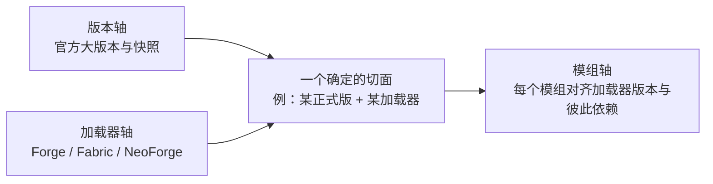

> **本章命题**：模组的生存地基不是官方接口，而是注入——模组依赖的是官方代码的内部实现，因此模组的维护成本不由自己的功能决定，而由官方每一次更新重算，这就是模组比引擎本身更难维护的原因。若模组只靠一套官方承诺稳定的公开接口就能长期存活，本命题不成立。

## 问题

每个大版本发布日，Minecraft 的模组社区都会准时上演同一场搬家。官方更新照常推送，游戏本体安然无恙——不装模组的玩家点一下更新，照玩。装了模组的玩家不敢点：他们清楚，点下去，mods 文件夹里几十个模组大概率集体失效。接下来的一两周，模组作者们陆续发布适配，大模组晚一些，小众的更晚，整个生态像退潮后再涨潮，几周后才恢复到能正常「住人」的状态。

奇怪的地方在这里：**官方改的是引擎，搬家的却是房客。**引擎本身每次更新都运行得好好的，为什么被折腾的总是模组？换任何一家有官方模组接口的游戏，答案都该是「接口没变，模组不用动」。Minecraft 的答案是：它从来没有这样一份接口。

本章把这件事从根上拆开。先讲清楚为什么每次更新都是一次返工——这要引出全书这个生态最核心的一句话：**没有稳定接口的时候，注入就是接口。**然后分两条河看社区怎么在没接口的地基上盖房子：客户端模组河从字节码手术走到缝合术 Mixin，再到 Forge 与 Fabric 两种加载哲学的并立；服务端插件河用 Bukkit 的接口与实现分层，交出了另一份更稳定的答卷。接着看加载器到底解决了什么——隔离、钩子点、初始化顺序——最后算总账：版本、加载器、模组三个维度相乘的兼容矩阵，以及为什么这道乘法题决定了模组比引擎更难维护。

范围先说清：本章是 Java 版生态的架构章，Java 程序的字节码能被工具还原、被工具改写，注入才有戏可唱；Bedrock 版用 C++ 写成，对应物是官方附加包加脚本 API，走的是另一条官方供路的路子，卷三第 15 章专门处理。两条河的历史与人物——MCP、Risugami、Forge 的诞生、Bukkit 团队被收编——[《模组作为第二作者》](/history/mods-as-authors)已经讲过，本章只借结论，专讲架构：这些东西为什么长成这样，而不是别的样子。

## 为什么每个大版本都是模组的末日

先看「末日」的机械过程。Minecraft 的程序发布出来是字节码——半成品的机器指令，介于源代码和成品之间，工具能把它还原成接近源码的可读文本。官方设了一道防：发布时把代码里所有内部名字替换成无意义的字母，让人读不懂。社区的办法是配字典：MCP 把每个版本的乱码名字一一配回可读名字（卷一第 4 章讲过这段）。模组作者照着字典读官方代码、写模组、再编译回去。

所以官方一次大版本更新，对模组生态是一条四环相扣的断裂链：**官方改了内部实现，乱码名字跟着重排；字典要重配；模组要照新字典重写重编译；模组之间的冲突要重新调试。**四环环环要人，而且全部由无合同的志愿劳动者来干。这就是「末日」的全部内容——不是什么灾难，是按季度收税。

现在正面回答「为什么官方不提供接口，一劳永逸」。想象那份合同该长什么样：官方公布一批函数和数据结构，写明「这些你们随便用，我们保证长期不变」。Mojang 从未签过它——2012 年它雇佣了 Bukkit 团队筹备官方模组接口，这份接口直到今天也没有发布。[^w-bukkit] 不签的原因不复杂，两头都不划算。**接口做浅了不够用**：模组生态真正值钱的东西是补上一整层系统——能量、物流、维度（卷一第 4 章的论证），浅接口装不下这些，装下了就不是「接口」而是「半个引擎」。**接口做深了管不动**：允许外部代码依赖引擎内部，等于官方给自己判了「内部永远不得重构」的刑。可内部重构恰恰是官方清理自己技术债的主要手段——2018 年的 1.13 在官方侧是一次数据层大清理，在模组侧则意味着内部标识的大重排，全体模组返工。官方的每一次还债，都是模组的一次交税；这两本账记在不同的本子上，Mojang 的账本上没有模组社区这一栏。

于是事实上的合同出现了，条款和真合同正好相反：不是官方承诺「我们不变」，而是模组承诺「你变我就修」。**模组依赖的东西，从「官方答应给的接口」变成了「官方代码此刻碰巧长成的样子」——内部实现即接口，注入即 API。**这份合同没有稳定承诺，没有变更公告，没有弃用过渡期，全部条款由模组作者单方面履行。所谓「升级变成政治」，说的就是这种结构：官方一次更新，几千个作者的劳动安排同时被单方面改写，谁先适配、谁押哪个加载器、谁放弃哪个版本，全成了要谈判、要站队的决定——技术问题变成了协调问题。

这个判断怎样算错？如果官方某天发布一套覆盖面够深的稳定接口，而且大模组真的迁移过去、从此跨版本存活，那「注入即 API」就成了历史阶段论，本章命题作废。值得记录的是最近的一步：2025 年 10 月，官方宣布移除 Java 版源码的混淆。[^w-modding] 这一步撤掉了「读」的门槛——字典不用社区配了；但「写」的稳定性依然没有任何承诺，官方没说哪些内部结构不许改。门槛降低了，合同还是那份单边合同。

<Constraint name="注入即 API" verdict="凑合" chain="官方不提供稳定接口 → 模组转而依赖内部实现 → 兼容责任转移给无合同的作者 → 每次官方更新全体重算">
这套安排运转了十五年，撑起了几十万个模组，但它把兼容的全部成本转嫁给了生态里最没有议价权的一方。它成立的前提是一个罕见条件：有足够多技术强、不要钱、还愿意追版本的人。换个没有这种志愿者储量的游戏，同样的架构就是生态直接死亡。
</Constraint>

## 客户端模组河：从字节码手术到 Mixin

客户端模组河的历史进程归卷一第 4 章，这里只拆架构演化——每一步演化解决的都是「注入」带来的同一个病：**不稳定面太大**。所谓不稳定面，就是模组依赖的、官方随时会动的代码总量。

最早的办法是字节码手术：直接解开游戏文件，把里面的类改掉，再打包回去。手术的问题不在难，在挤——两个模组都去改同一段官方代码，后动的会把先动的盖掉，装三个模组崩两个。ModLoader 定下了「从哪里进入」的规矩，Forge 则把规矩升级成一套完整制度：**把手术变成挂接。**Forge 事先替官方开好一批「口子」（钩子点）：模组不再自己动刀，而是把逻辑挂到口子上；模组注册的新方块、新物品统一登记到 Forge 的注册表里，编号撞车从此消失。它的 GitHub 仓库简介把这层意思说得毫不起眼又极准确——「对 Minecraft 基础文件的修改，以帮助模组之间的兼容」。[^gh-forge] 内置的加载器 FML（Forge Mod Loader）把装模组这件事也接管了。自此「改官方源码」从模组作者的必修课降级为框架内部的事，维基百科对这一步的概括是：Forge 终结了直接改动基础代码的必要性。[^w-modding]

Forge 的哲学由此定型：**重量级、全功能**。加载、注册、渲染接入、网络、配置、存档接入，一个框架全包——模组作者学会一套，什么都能做；代价是整个工具链重，跟版本慢，而且官方一出新版本，这个大块头要整体适配完，下游才能动工。这就是不稳定面的第二种形态：虽然不用自己动刀了，但依赖的是 Forge 这整层东西，Forge 适配到哪，模组才能活到哪。

架构上的关键一跃来自服务端。Sponge 是 2014 年前后立项的服务端平台，它带出了 Mixin 这件工具：[^w-modding] 用一句白话说，**Mixin 是把一小段逻辑织进官方方法的缝合术。**你写一个普通方法，标注它该缝进哪个官方类的哪个方法、缝在开头还是结尾还是替换某一行；游戏启动、官方类被装入的那一刻，织入器把你的代码真缝进去，官方类从此多了一段它自己「不知道」的逻辑。技术上是字节码改写，框架自己定位是「基于 ASM 的混入与字节码织入框架」，挂在运行时的类装入流程上干活。[^mixin]

Mixin 的架构意义不在省事，在于它把钩子点的决定权从框架手里拿了回来：Forge 的口子是框架预埋的，官方代码里没埋的地方就挂不上；Mixin 让任何一行官方代码都可以变成挂接点。钩子从「框架给的」变成「模组自选的」，重活不用全家桶也能干了——这直接为下一个加载器铺平了道路。

2018 年 12 月，Fabric 发布。[^w-modding] 它的自我定位只有一句：模块化的轻量加载器。[^fabric] 架构上它把 Forge 的全家桶拆开了：加载器本体做到极小，只管装模组、管顺序、跑织入；其余能力——事件、网络、命令这些——单独做成一个叫 Fabric API 的普通模组，要用的人自己装。映射字典也换了做法：Forge 系的字典随自家工具链走，Fabric 侧的 Yarn 映射是开放版权的独立项目，由 FabricMC 社区维护，谁都能用。[^fabric]

<Alternative title="两种加载哲学：全家桶与最小核心">
Forge 的答案是「一个框架解决所有问题」：新手上手路径统一，大型内容模组要的服务一件不少，但链路重、适配慢，且深度绑定框架自己的节奏。Fabric 的答案是「最小核心加可选件」：加载器小、跟进官方版本的节奏快，代价是基础能力要自己拼装，生态里两套东西并存。两者没有裁判：大型模组要的是 Forge 的全套服务，轻量模组要的是 Fabric 的低负担。判断标准不在架构优劣，在你目标的模组群住在哪条河上。
</Alternative>

2023 年 7 月，这条河又分了一次岔：Forge 的大量开发者与贡献者宣布从原项目分裂，另立 NeoForge。[^w-modding] 分裂的近因是一场路线与许可之争——原项目此后在许可条款上收紧，新项目则以「自由、开源、社区导向」立旗，采用宽松的 LGPL 许可继续演进。[^neoforge] 细节谁对谁错本章不裁——那是治理问题，不是架构问题——但结构后果必须记下：**给模组提供稳定面的那个层，自己也不稳定了。**「升级变成政治」在这里具象化：一个 Forge 模组作者醒来发现自己面对两个不兼容的「Forge」，得选边、得移植、得向玩家解释为什么两个版本不能互通。加载器从公共设施变成了需要自己站队的阵营。

## 服务端插件河：接口层与实现层

插件河对同一个难题给出了另一种解，结构上干净得多：**把不稳定收口到一层。**

Bukkit 从第一天起就是两层。上层是 Bukkit 本体，一份纯接口——一份「服务器的语法书」，规定插件能对服务器提哪些要求、能听到哪些事，以 GPL 开源；下层是 CraftBukkit，让 Mojang 官方服务器程序真正跑起插件的包装层，以 LGPL 开源。[^w-bukkit] 插件作者只面向上层写代码，一行官方服务器代码都不碰；所有肮脏活——反编译官方代码、开钩子、缝进去——集中在下层的实现层里干一次，所有插件共享。不稳定的官方内部被关在实现层这个笼子里，笼子外是几万个安稳的插件。

这套结构里最值钱的部件是事件系统。白话版：**服务器每发生一件事，就发一张公告；插件预先登记「我对这类公告感兴趣」，收到后可以读取细节、改写结果，甚至把这件事直接取消。**玩家进服是一张公告，挖掉一个方块是，一只怪物受伤也是。机制上，插件实现一个监听器接口，用注解标明哪个方法处理哪类事件，服务器按事件类型归档、按优先级排队分发，可取消的事件统一带一个取消开关。[^spigot-javadoc] 这套「订阅—分发」的价值有三层：插件不侵入游戏主循环，服务器照常走它的刻（卷三第 5 章）；插件之间天然不踩脚，各自登记各自的公告；官方行为可以被拦截和改写，而官方代码一个字都没动。Bukkit 把这套模型做成了整条河的通用语言——此后这条河上的所有实现都原样继承了它。

接口与实现分层立刻显出它的红利：**实现层可以整块换血，上层毫无察觉。**CraftBukkit 停滞后，Spigot 接棒（2013 年 1 月更名）；2014 年 6 月，因为不满 Spigot 拒收社区贡献，Paper 从 Spigot 分叉而出，专注做实现层的大规模性能优化。[^w-bukkit] 插件作者没有为这些优化改过一行代码——他们甚至不需要知道 Paper 改了什么。到 2025 年年中，公开统计记录到超过十三万台 Paper 服务器同时在线，占这条河的六成以上。[^w-bukkit] 用户看不见的那一层随便优化，看得见的接口纹丝不动——这就是「把不稳定收口到一层」的全部收益。当然这条河也有自己的法律暗雷：开源的壳包裹着 Mojang 专有的芯，许可证在法律上并不成立，2014 年的那次 DMCA 下架把它引爆（卷一第 4 章的末尾与[《服务器即新游戏》](/history/servers)详述）。雷是法律的，不是架构的——架构本身至今仍在运转。

把两条河并排放下，差别一目了然。客户端河里，每个模组各自面对官方内部，不稳定面按模组数量相乘；插件河里，只有一个实现层面对官方内部，不稳定面被压成常数。客户端模组每换一个官方版本都要全员重修，插件常常跨过好几个版本照常能跑——不是插件作者更勤劳，是他们站在了一层别人替他们扛住不稳定的接口上。对「注入即 API」，插件河的回答不是否认，而是收口：既然必须有注入，那就让注入只发生在一个地方。

<Note>
两条河各造了一层「假接口」：Bukkit 接口不是 Mojang 承诺的，Forge 的钩子也不是。它们稳定，不是因为官方担保，而是因为整条河的人共同供养——社区自己给社区开合同。
</Note>

## 类加载、事件、生命周期：加载器到底解决了什么

先白话一个底层岗位。Java 程序运行时并不是一口气把所有代码读进内存，而是用到哪个「类」才装哪个——负责装的这个角色叫类加载器。它决定哪个类从哪里来、什么时候来、重名了听谁的。这个岗位听起来枯燥，对模组生态却是命门：**所有注入都发生在类装入的那一刻**，类一旦装完就定型，再想改就得动运行中的程序。

加载器到底解决了什么？拆开是三件事。

第一件，**制造钩子点，并守住下针的时机。**官方代码里没有为模组留的口子——一个都没有。整个生态用到的所有挂接点，全部是加载器造出来的，造法有两种。一种是静态预埋：Forge 修改官方代码时埋进钩子，注册表和事件分发器都属于这类，服务器在固定位置喊一声「有事发生」，插件就能听见。另一种是动态缝合：Mixin 在类装入前的瞬间把代码织进去，晚一步类就定型。这直接回答了「为什么加载器是必需品而不是可选件」：只要模组的实现方式是注入，就必须有一个角色掌管类装入的时机——不掌管，就没有下针的地方；每个模组自己抢着下针，就退回互相覆盖的手术时代。

第二件，**写死进场的顺序。**几十个模组同场，先来后到不是礼仪问题，是生死问题：A 模组注册的方块要被 B 模组的机器识别，B 就必须在 A 之后初始化；两个模组共用一个基础库，这个库必须最先就位。所以每个加载器都规定一套生命周期：发现模组、读取依赖声明、按依赖排序、构造、注册内容、初始化——谁的配置里写了依赖谁，谁就排在后面。玩家看到的只是「模组装上了」，背后是加载器把几十个互不相识的作者的代码，排成一个不出错的进场序列。

第三件，**隔离与仲裁。**白话版：类加载隔离就是每个模组自带一套书架，书互不串架——两个模组哪怕用了同名同版本的库，也各读各的，谁也覆盖不了谁。不过 Minecraft 的现实比教科书含蓄：模组之间还要互相调用、共享内容，完全隔离就没了自己的生态，所以实际的加载器更像分区图书馆——内容各归各架，借阅大厅共享。隔离是选择性的：把会打架的隔开，把要合作的放进同一个大厅。再加上重名资源的仲裁、重复类的裁决，加载器实际上是这个生态的户籍与公证处。

三个机制可以收成一个视角：**事件是运行时的钩子，Mixin 是装入时的钩子，注册表是内容登记的钩子——加载器的本职，就是在官方什么都没提供的地方，制造并管理整个生态的钩子点。**「加载器到底解决了什么」的最终答案有点扫兴：它解决了「官方什么都没解决」。

## 兼容矩阵：版本 × 加载器 × 模组的三维爆炸

把前面的零件摆上桌，能看清模组生态真正的维护对象是什么了。它不是一条线，是一个三维空间，三条轴各自都不听话。

**版本轴**由官方单方面决定：大版本隔几个月一个，中间快照穿插，每动一次，内部实现就重排一次。**加载器轴**上站着 Forge、Fabric、NeoForge 三条线，各有自己的版本号，官方出新版后各自适配、进度不一，2023 年之后这条轴自己还多了一次分岔。**模组轴**最拥挤：仅 CurseForge 一个平台的模组就超过二十万个（2025 年 3 月），[^w-modding] 每个模组又声明自己要哪个加载器、哪个版本、依赖哪些别的模组。装一套模组，就是在三条轴上同时选点：

三条轴相乘，就是兼容矩阵的真实尺寸。玩家的每一次「模组装好了」，都是矩阵里一个被验证过的点；任何一条轴移动，相关点全部作废重验。官方发新版动的是版本轴，加载器三家用各自的节奏追官方，模组作者再等加载器——一条轴动，另外两条轴连环跟着动。

整合包作者就是这道题的人形求解器。他们的工作流程，本质是在矩阵里先钉死两条轴——选定一个版本、一个加载器，得到一个切面——然后在切面内部求解模组轴：几十上百个模组，谁的依赖缺口、谁的编号冲突、谁和谁的功能打架，逐一调平。整合包这个形态在 2010 年代流行开来，本身就是矩阵太难的社会证据：普通玩家放弃了自己装配，把求解外包给了策展人。

对模组作者，矩阵是一道发布策略题。支持两条加载器，成本翻倍——同一份逻辑要按两套接口各写一遍，测试也翻倍；只押一条，等于向另一边的用户群关门。NeoForge 分岔之后这道题更难：原来「Forge 模组」是一个点，现在要在 Forge 与 NeoForge 之间再做一次移植与站队。「升级变成政治」的最后一层含义在这里——连「我的模组支持哪里」都成了要公开回答的立场问题。

现在可以正面收束本章的问题了：**为什么模组比引擎更难维护？**引擎的维护者面对一份自己控制的代码库：改动之前知情，改完能跑测试，节奏自己定，成本随自己的功能累加。模组维护者面对的是三件管不住的东西的乘积：一个随时会变的地基（官方内部实现，改动无预告）、一层各有节奏的中间板（加载器，还可能分裂）、一群互为依赖的邻居（其他模组，别人弃坑你遭殃）。**引擎的成本是累加制，模组的成本是清零制**——每次官方大版本更新，模组的维护成本不是增加一块，而是整个重算一遍。哪边更难，取决于别人动的次数和自己写的行数哪个多；十五年来，前者从没输过。

这个判断怎样算错？出现一套官方稳定接口、大模组迁移其上、矩阵塌缩成二维——维护难度回落到普通软件的水平，本章结论过期。目前它没有发生：2025 年 10 月官方移除混淆，降的是「读」的门槛，版本轴的动荡一格没少。重写卷会给这个问题一个正面的设计回答——[《脚本与模组的双层》](/rewrite/scripting)提议把「稳定接口层」与「注入层」明确分成两层、各管各的；本章的两条河恰好是那个提案正反两面的既有证据：插件河示范了收口能换来什么，模组河示范了不收口要付出什么。

## 这一章留下什么

- **爱好者**：模组迟迟不更新，通常不是作者偷懒，是官方动了矩阵的一条轴，全体作者在重新求解。装模组前先对齐三件事：游戏版本、加载器、模组声明的依赖——错一个，崩全套。
- **开发者**：能抄走的是插件河的收口结构——接口与实现分层，让优化零成本下放给全部上游；事件订阅，让互不相识的扩展不打架；生命周期声明，让加载顺序可预期。抄不走的是这条河本身：注入即 API 的秩序，靠的是一批不领工资、愿意每季返工的人，这不是架构能设计出来的。

[^w-modding]: Wikipedia，《Minecraft modding》，维基百科，检索于 2026-09-18，https://en.wikipedia.org/wiki/Minecraft_modding （Forge 与 FML 约 2011 年 11 月发布、「终结了直接改动基础代码的必要性」；Mixin 由 Sponge 于 2014 年前后引入；Fabric 于 2018 年 12 月发布；NeoForge 于 2023 年 7 月从 Forge 分裂；CurseForge 模组超过 20 万个（2025 年 3 月）；2025 年 10 月移除源码混淆）

[^gh-forge]: MinecraftForge 团队，《MinecraftForge》仓库简介，GitHub，检索于 2026-09-18，https://github.com/MinecraftForge/MinecraftForge （仓库简介原文：「对 Minecraft 基础文件的修改，以帮助模组之间的兼容」）

[^mixin]: SpongePowered，《Mixin》仓库 README，GitHub，检索于 2026-09-18，https://github.com/SpongePowered/Mixin （「基于 ASM 的混入与字节码织入框架」；挂钩运行时的类装入流程完成织入）

[^fabric]: FabricMC，《Fabric》官方网站，检索于 2026-09-18，https://fabricmc.net/ （「模块化的轻量加载器」定位；Fabric API 作为普通模组单独分发；Yarn 为开放版权（CC0）的 Minecraft 映射集，由 FabricMC 维护）

[^neoforge]: NeoForged 团队，《NeoForge》仓库，GitHub，检索于 2026-09-18，https://github.com/neoforged/NeoForge （「自由、开源、社区导向的模组 API，基于 Forge」；采用 LGPL-2.1 许可证）

[^w-bukkit]: Wikipedia，《Bukkit》，维基百科，检索于 2026-09-18，https://en.wikipedia.org/wiki/Bukkit （Bukkit 以 GPL、CraftBukkit 以 LGPL 开源，许可因混入 Mojang 专有代码而不成立；2012 年 2 月 28 日团队加入 Mojang，官方模组接口从未发布；Spigot 于 2013 年 1 月 15 日更名；Paper 于 2014 年 6 月 23 日因 Spigot 拒收社区贡献而分叉；2025 年 6 月 bStats 记录超过 13 万台 Paper 服务器在线、占生态六成以上）

[^spigot-javadoc]: SpigotMC，《Spigot-API：org.bukkit.event 包文档》，Javadoc，检索于 2026-09-18，https://hub.spigotmc.org/javadocs/spigot/org/bukkit/event/package-summary.html （Listener 监听器接口、EventHandler 注解、EventPriority 执行优先级、Cancellable 事件取消机制）
