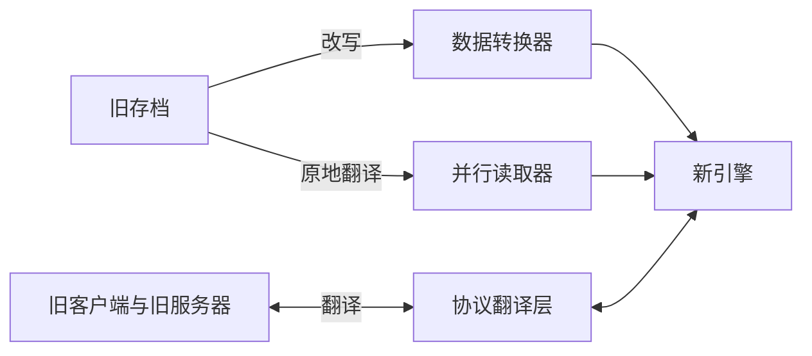

> **本章命题**：对重写而言，能读旧档是伦理义务，不是可选特性——玩家是按「世界不会作废」这个既成承诺投下时间的，新引擎要么兑现这笔储蓄，要么单方面赖账。

## 问题

重写项目最常见的死法，不是新引擎写不出来，而是上线那天没人搬得进来。玩家打开新版，把陪了自己多年的世界文件夹拖进去，然后遇到三种下场之一：读不出来；读出来了，农场不转；农场照转，机器的行为却变了——玩家对着自己造了三年的装置，认不出它的脾气。三种下场通向同一个结局：回到旧版本。重写赢得演示，输掉人口，最后成为一座精装的空城。旧档与旧生态因此是重写的入场券；上一章处理完渲染与创作工具，本章处理这张入场券怎么发行。第 4 章已经把旧档读取安置成新世界表示的导入接口，那是架构位置；本章补的是政策：先论证能读旧档为什么是义务而不是特性，再设计兑现义务的三条通道，处理最棘手的红石，交代最便宜也最不容破坏的门牌号纪律，最后把全部代价写进产品范围。

## 玩家的时间存在存档里

把「义务」这个词撑起来需要四步，一步都不能省。

**第一步：玩家的过去以存档的形式存在。**一个玩了三年的生存世界里有什么？被矿道掏空的山体、绕村一半的铁路、按点收割的自动化农场、一台上了年头的红石钟、末地传送门旁边那座始终没完工的桥。加在一起，是成百上千个小时的投入。存档不是进度条，进度条只记录你走到了哪；存档是账本，记录你把多少生命换成了方块。卷二第 16 章的[《可迁移原则清单》](/design/transferable)把它立为原则十一：世界比引擎活得久；卷四第 2 章把它译成不变量。这里要补的，是它为什么对重写构成义务，而不只是愿望。

**第二步：投资物必须可携带，否则所谓拥有只是租期。**把世界拷给朋友、搬到新电脑、传上服务器、在十年后的版本里打开——可携带不是便利，是玩家敢于投入的前提。一个人肯花三个周末给基地修一条绕远的水渠，前提是他相信这段投入明天还在。假如重写版宣布新引擎不读旧档，发生的不是「少了一个功能」，而是玩家已储蓄的资产被单方面宣布作废：买卖悄悄改成了租赁，而且新租约不由房客起草。

**第三步：这个承诺不是本章替谁编的，是十几年既成事实养出来的。**Java 版今天仍能打开十多年前的存档；版本一路换代，官方从没说过「旧世界过期请弃置」。卷一第 13 章把这扇「旧存档的官方后门」看作文化遗产的一部分（[《作为文化遗产的 Minecraft》](/history/heritage)）——服务器世界承载的还不止个人投入，更是一群人的公共记忆。既成事实会创造正当预期：玩家正是相信世界不作废，才敢做长期投入；正当预期积累十几年，就构成义务，哪怕它从未写进任何用户协议。继承这份承诺，和继承那些代码资产一样，是重写者签收遗产时一并签下的负债。

**第四步：由此给出特性与义务的判据。**特性的标志是可选、可延期、可差异化。逐条检验读旧档：它不可选——存量玩家的世界非此即彼，要么被打开，要么被锁死，没有「暂时不提供」的中间地带；它不可延期——玩家不会暂停生活等重写项目补票，锁上三年，三年的新记忆早已各奔东西；它不可差异化——拿「旧档迁移」当高级版卖点，等于向最忠诚的用户收第二笔钱，罚没的恰恰是忠诚。三关全过的东西不是特性。义务的标志是：做到了不算功劳，做不到构成伤害。

这句判断怎样算错？三个方向都可以证伪。其一，义务出自时间投资的结构，不是出自道德律令本身：一款每一局相互独立、投入不跨局累积的游戏（竞技匹配、单局制生存），读旧档确实只是贴心特性。其二，如果产品从第一天就明说存档是临时的，义务不成立——知情同意的换季不是背弃，卷四第 2 章对定期重置的服务器世界已下过同样的判决。其三，也是最阴的一条：名义能读，实际已变。字节读进来了，机器不再按原样工作，农场成了雕塑——「能打开文件」不等于「能读旧档」。这一条直接引出红石一节。Minecraft 家族不满足前两个豁免条件，所以对它，义务成立。

## 转换器与协议适配

义务认了，接下来是兑现的技术形状。所谓「旧的东西」，其实旧的有三种：旧数据、旧格式、旧客户端与旧服务器，各对应一条通道。

**通道一：数据转换器，把过去改写成现在。**加载旧档时，把数据一次性升级成新格式。卷三第 2 章（[《存储与序列化》](/impl/storage)）讲过现状：Mojang 把这套机制做成了独立的库 DataFixerUpper[^dfu]，每发布一个版本，就在链条末尾追加一节「从上一版到这里，每种数据要怎么改」，读旧档时从头逐级执行。1.13 那次著名的扁平化——数字编号全面换成命名空间字符串——就是靠这条链条把所有玩家的旧档改写了一遍。转换器的优点干脆：一次转换，终身受益，新引擎只需要面对一种格式。代价同样干脆：转换不可逆，改坏了没有回头路，所以转换前的自动备份不是贴心，是这道工序的另一半道德；转换器还是一部永远在加页的历史书——历史上每个版本的每个数据缺陷，都得在库里留一道修补，链条越积越长，要定期压实合并，否则新旧档的加载一起变慢。

**通道二：并行读取器，让过去保持过去。**一个字节都不改，在新引擎旁边保留旧格式读取器，运行时翻译进来。优点：旧档保持原样，随时可退，转换器出了错还有退路，两套读取还能互相校对。代价：永久的双份维护，每条读取路径事实上写两遍；而且旧读取器永远不许删——存量世界不退休。它适合格式换代的断层期与转换器尚未写完的过渡期。实践里两条通道往往组合使用：读取器兜底，转换器收编。

**通道三：协议翻译层，救的是生态，不是存档。**存档躺在磁盘上，生态活在线上。重写不可能让所有服务器、客户端、插件一夜换血，迁移期需要一层翻译：新引擎的服务器对旧客户端说旧话，旧客户端照常进服。卷三第 10 章《网络协议》讲过，协议是版本政治里最敏感的神经；社区已经证明这条路能走多远——ViaVersion 插件让新版客户端进旧版服务器，靠的正是逐字段的协议翻译[^via]。翻译层的优点是生态不断血、迁移期不散伙；代价是它只能翻译双方共有的概念：旧客户端永远看不见新内容，新机制在翻译里退化成最低公共标准；而且翻译层自己会变成事实标准，同样需要冻结、测试与长期维护——它不是搭完就拆的脚手架。

三条通道合起来看：

<Note>Java 版与 Bedrock 版的存档互不通用：一边是 Anvil 一系的区块格式，一边是 LevelDB 键值库。对重写来说，「读旧档」因此不是一项义务，是两项——Bedrock 那边还有附加包与官方商城构成的另一条已经分叉的生态，不能拿 Java 的方案顺手糊过去。</Note>

## 红石双路径：仿真层与新语义

三条通道解决「搬得进来」，解决不了「搬进来之后照原样生活」。最难的住户是红石。卷三第 8 章（[《红石的实现》](/impl/redstone)）留下过一桩两难：红石语义里被依赖最深的部分——准连通性、更新顺序的种种怪癖——本是实现的偶然，却被玩家当成契约，数不清的机器按它们建成；修正语义，存量机器集体失灵；冻结语义，新引擎背上全部历史包袱。卷四第 3 章审「偶然」清单时给过拆解原则：先付清依赖，再拆本体，官方的先例是修一个正门（观察者方块之于 BUD）。但正门只帮到愿意重建的玩家；存档里躺着的是无数匿名的机器，它们的作者可能早已离开，没人替它们重造。解开两难，要先拆它共同的前提——全世界只能有一套物理。

拆法是把物理从引擎的属性降为世界的属性。新引擎内置两套红石语义，随存档走：新世界用新语义，确定的重算顺序、干净的信号形状，这是重写在红石上全部进步的兑现处；导入的旧世界标记为旧物理，由仿真模式接管——在新引擎里复刻旧引擎的可观察行为，准连通性照常灵，时序怪癖照常怪，验收判据只有一句话：旧机器照原样转。照全卷纪律，这里给的是方案形状，不是施工图。

<Alternative title="只留一套物理，行不行">

两种单一路径都想得出来。只留新语义，最干净，从此没有历史包袱，代价是断代：存量机器集体失灵，「世界比引擎活得久」在红石上整体违约，红石社区会第一个离开——而他们正是把物理玩出设计之外的人。只留旧语义，让新世界也跑仿真，最保真，代价是重写在红石上永远作废：新语义的一切改进没了着落，两难原封不动。双路径不是折中，是承认两笔账记在不同人头上：存量机器欠旧物理，未来世界欠新语义。

</Alternative>

两套并存有三个前提，缺一个双路径就会散架。其一，物理版本必须写进存档元数据，打开世界那一刻定死，不许中途切换——切换物理等于拆掉玩家所有机器重造，正是本章要避免的那种伤害。其二，两套语义必须藏在同一套接口后面，红石更新只认接口、不认实现；否则代码里会长满「如果是旧物理」的岔路，双路径名存实亡。其三，不许跨物理合并：旧物理的区块不能拼进新物理的世界；结构导入按目标世界的物理重建，并明确警告可能变形。

代价要数得比条件更清楚，双路径不假装免费。第一，双倍测试：红石相关的每个改动都要在两套语义下各验一遍，而「照原样转」需要证据——建一座老机器标本库，回放刻序列、逐刻比对，这活没有终点。第二，仿真层是琥珀：旧物理从此只能保真、不能改良，旧语义里的真缺陷也得照抄，因为它们早已是契约的一部分。第三，漂移风险：复刻的是行为，不是代码；如果旧行为本身依赖并发的不确定性，仿真只能复刻出统计行为，个别边缘机器（老式 BUD 探测一类）可能仍要玩家亲手微调——这是仿真层诚实的天花板。第四，也是最长的一笔：存量世界只会增加，不会减少，仿真层没有「完工」的日子，它是一笔永续支出。永续支出怎么管，留给最后一节。

## 命名空间的长期兼容

兼容清单里还有一件几乎不花钱、却最不容破坏的东西：门牌号。卷三第 13 章《数据包、资源包与数据驱动》讲过，Java 版每个方块、物品、实体都有形如 minecraft:stone 的命名空间地址，模组与数据包用自己的前缀登记。这个今天看来平淡的设计，是整套兼容体系的地基：存档里的每一格数据、命令方块的每条命令、数据包的每张配方、结构方块里封存的机器，全靠门牌号互相指认。字符串就是指针。

为什么新引擎必须原样继承，并且永不改动？因为改名不是重构，是烧路牌。一个方块改了名，所有存档里它出现过的每一格都要改写，引用它的命令、配方、进度、结构全部失配；任何一处漏网，那个世界就读不全。而重写者最容易犯的错恰恰在这里：「反正重写，顺手把名字起得好听点」。门牌号的全部教训正相反——名字的价值来自不变，不来自好听。它还是兼容账单上唯一越守越便宜的一项：转换器按年付费，冻结门牌号是每天什么都不做；可破坏它一次，赔偿永远算不清。

纪律可以写成三条。一，minecraft: 前缀下已登记的名字只增不改：可以让旧名字指向新实现，不可以删除或改写旧名字本身。二，弃用不删除：要退役的内容给一个占位实现，保证加载不炸，而不是从表里抹掉。三，自定义前缀属于登记它们的社区，新引擎承诺永远解析它们——这是对模组生态的正式承诺；卷三第 12 章里那份令人头晕的兼容矩阵，正是这门功课历次挂科的记录。

<Constraint name="门牌号只增不改" verdict="地基" chain="改名 → 引用失配 → 存档读不全 → 生态重置">

命名空间是全生态共用的地址系统，地址的价值与它的变动率成反比。重写在这件事上没有创造的空间：创造得越多，赔得越多。

</Constraint>

## 把代价写进范围

兼容不是免费的，账单也不是一次性的：三条通道、双路径、门牌号纪律，都要长期占用工程预算。它们的死法通常有两种。明面上，是预算紧张时第一个被砍——砍的时候没人觉得在违约，因为它从没在路线图上正式出现过。暗面上，是没有验收的兼容悄悄烂掉：某个版本起，转换器悄悄改坏一类机器，没有测试拦截，没有负责人发现，直到玩家发现——那时赔进去的不只是工时，还有信誉。两种死法指向同一个缺口：义务没有写进产品范围。

写进范围的具体形态是三份文件。第一份是预算：给兼容一个与新特性同等地位的明确份额，并写明负责人——「大家都有责任」的意思是没有人有责任。第二份是验收：兑现义务有上线门槛，不是事后补票。上线标准里写明一条：样本世界库全部通过——收集各年代的真实存档（十多年前的老格式、扁平化前后的、装满红石阵列的、模组服的残档），转换或读取后逐项比对，一项不过，不发版。义务必须可验收，否则只是愿望的敬语。第三份是边界：诚实的承诺有地平线。宣布「某一年之后的存档，官方不再保证」，不是背弃——提前划出的边界本身就是承诺的一部分；背弃指的是事后的沉默。划界有三条纪律：按存档格式划，不按日历划，格式可判定，日期武断；划界之前留足公告期，让玩家来得及迁移，如同服务器换季提前贴出告示；划界降级的应当是「官方转换」这一档服务，而不必是「可读」本身——并行读取器可以继续活着，或者像 ViaVersion 那样把接力棒交还社区，前提只有一个：别把门焊死。

到这里可以回头检验命题了。「能读旧档是伦理义务」的完整论证是一条四环的链：玩家的过去存在存档里，所以投资物必须可携带，否则产品就是租赁；可携带已被十几年的既成事实许诺，所以正当预期构成义务；而义务不靠情怀运转，它的可操作形式就是有预算、有验收、有边界的工程制度。反过来，一个重写项目若三样都拿不出来，只会重复同一句「我们重视兼容」——那句话连特性都算不上，是装饰。

## 这一章留下什么

- **爱好者**：下次看到「全新引擎」的重写，先问一句——它打得开你 2013 年的那个世界吗？打开之后，你的机器还在转吗？
- **开发者**：抄得走的是三条通道、双路径、门牌号纪律这套制度；抄不走的是把它们与特性一起写进预算、并守住上线门槛的决心——义务没有排期，就等于从未承认。

[^dfu]: Mojang Studios，《DataFixerUpper》，GitHub 开源仓库，MIT 许可，自述「为将 Minecraft: Java Edition 的游戏数据在不同版本之间转换而创建」；见 https://github.com/Mojang/DataFixerUpper 。

[^via]: ViaVersion 团队，《ViaVersion》，GitHub 开源项目，自述「允许较新的客户端连接较旧的服务器版本」，以协议翻译实现；见 https://github.com/ViaVersion/ViaVersion 。
