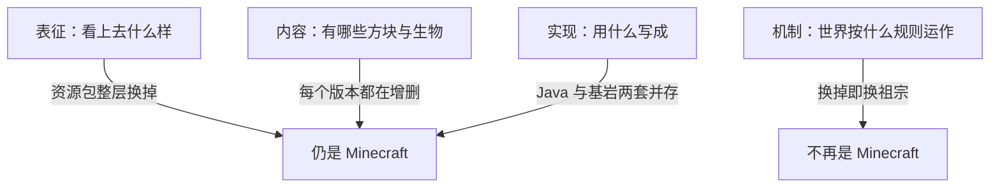

> **本章命题**：「Minecraft 味」的本体不在表征、不在内容、也不在实现，而在机制层的七条不变量。一款产品只要守住这七条，换成任何画风、任何内容、任何代码，玩家仍然承认它是 Minecraft 类；反过来，只要拿掉其中任何一条而玩家社区依然公认它是 Minecraft 类，对应条目即被证伪。

## 问题

重写者的第一道题不是「怎么写」，而是「什么不能动」。上一章回答了「我们到底在重写什么」，这一章往里走一步，问那件被重写的东西最少要剩下什么，才还配叫原来的名字。

麻烦在于，答案最初只能以感觉的形式出现。老玩家判断一个产品「有没有 Minecraft 味」往往只要十秒钟，但你请他拿出证据，他说出的多半是画风、是方块、是某段熟悉的音效。感觉没法写进答题纸，答题纸需要的是可以逐条核对、也可以逐条推翻的句子。本章的全部工作，就是把这份感觉翻译成机制清单，回答一个问题：**去掉哪些东西，它就不再是 Minecraft？**

翻译之前先立一条规矩。本卷是考试，不是开工令：下面每一条不变量都附带两样东西——「拿掉之后玩家会立刻察觉什么」的具体场景，以及「怎样算这条错了」的证伪判据。判据统一成一句话：**如果有一款产品拿掉了它，玩家社区却依然公认这是 Minecraft 类游戏，这条不变量就被推翻。**裁判是玩家的长期公认，不是本章的先验权威。

## 「Minecraft 味」哪一部分是规则

「像 Minecraft」这种感觉，其实混着四种不同的东西，必须先拆开。

**表征**，是它看上去什么样：像素贴图、方块造型、那套界面。表征显然不是本质——资源包把石头换成水彩、把生物换成剪纸，玩家照样承认这是 Minecraft。卷二第 16 章的换皮测试说的就是这件事：表征可以整层换掉，而产品还是它。

**内容**，是世界里有哪些东西：多少种方块、哪些生物、每种附魔给多少加成。内容也不是本质——每个版本都在往世界里加东西、删东西、改东西，社区会为某次改动吵得天翻地覆，但吵的题目是「改得好不好」，从来不是「这还是不是 Minecraft」。

**实现**，是它用什么写成：什么语言、什么架构、什么渲染管线。实现还不是本质——Java 版与基岩版是两套各自独立的实现，连存档格式都不通用，可双方玩家都承认对面那个人玩的是 Minecraft。

**机制**，是世界按什么规则运作：空间是不是切成格子、挖掉的东西去了哪、玩家有几个基本动作、目标由谁出。到这里才碰到本质。把一米网格换成连续平滑的地形，把挖掘换成「对着物体长按删除」，哪怕画面做得一模一样，老玩家五分钟内就会下结论：这是一个像 Minecraft 的别的游戏。

四层关系可以画成一张图：

不变量就住在机制层。但机制层里还嵌着一种特殊住户：被社区依赖的实现细节，比如每秒二十刻这个具体数字、红石系统里那些出了名的小怪癖。它们一半算机制、一半算实现，本章不收——它们留给下一章的「偶然」清单。

最后写清三张清单的关系，免得读者以为这本书发了三套互相打架的答案。卷二第 16 章的[十二条可迁移原则](/design/transferable)是**方法论**：它回答「设计这类产品时该怎么想」，每条带适用前提。卷三第 18 章的[五条最小内核](/impl/modifiable-engine)是**架构**：它回答「引擎里必须留住哪些部件」——用卷三自己的比喻说，一本账（世界数据）、一座钟（模拟节拍）、一个裁判（权威归属）、一张表单（内容注册）、几道活门（可拆换的边界）。本章的七条不变量是前两者的**产品层翻译**：它回答「玩家手里的成品必须保留什么，才还叫这个名」。三套清单是同一件事的三个视角：想的时候用原则，造的时候守内核，验的时候数不变量。

对齐关系可以逐条查：

| 本章不变量 | 来自卷二的原则 | 来自卷三的内核 |
| --- | --- | --- |
| 一米网格与可破坏性 | 二（世界即库存）及其前提 | 一（体素账本） |
| 世界即库存 | 二 | 一（可寻址、可持久化） |
| 最小动词集 | 一、十二 | —— |
| 目标外包 | 三 | —— |
| 可误用系统的物理开放性 | 四 | 二（确定性刻循环） |
| 世界比引擎活得久 | 十一 | 一（持久化） |
| 再开发第一公民 | 十 | 四与五（插槽与活门） |

两张清单同本章没有冲突之处；出入只在颗粒度——原则二在产品层摊成了两条，网格一条、守恒一条。内核三（权威服务器）没有对应的不变量，因为它是纯架构判决，玩家没法从体验上直接检验，它的答卷由第二部「网络与权限」一章来交。至于十二原则里没进表的那几条——成长附着于物、程序内容合同、约束即深度、模式是权限、社会契约——它们是「怎么做好」的方法，不是「是不是它」的判据，玩家一眼验不了，所以进不了这张答题纸，留待第二部各自的位置再考。

## 七条不变量，逐条过堂

以下七条，每条按同样的四拍走：它是什么，为什么是本质，拿掉之后玩家会立刻察觉什么，以及怎样算这条错了。

### 一、一米网格与可破坏性

**它是什么。**世界由一米见方的格子组成，每一格都有地址，而且几乎任何一格都能被玩家改动——挖掉，或者放上别的。[《最早的体素》](/design/voxel-primitive)整章都在讲它，这里只取产品层的结论：网格是全游戏的度量衡，可破坏性则是对每个玩家入场时的承诺——这个世界任你改动。

**为什么是本质。**因为一切公共语言都踩在这条上。玩家身高两格，跳一格高，火把照亮七格——你可能从没算过这些数，但你的手早就会按格估计距离。更要紧的是说话：教程写「在门口上方留两格」，朋友喊「帮我把我头顶这格补上」，建筑比赛规定「限高三十格」——没有格子，建造者的这些日常用语一句都说不出来。

**拿掉之后。**换成平滑地形，世界立刻变漂亮，也立刻变哑。你没法指着一块地形说「第三格」，只能说「大概那个坡上面一点」；挖掘不再留下整齐的疤，改动不留痕迹，世界成了一块不能落笔的布景。它退化成一款好看的探索游戏：风景再好，也没有一处归你改，玩家从居民退成游客。

**怎样算这条错了。**如果有一款产品用连续地形，玩家却自发长出了一整套同样自然、同样可以口口相传的空间语言，而且人人都能随手改写世界、改动也都被承认——那么「必须网格」就被推翻，它只是 Minecraft 自己的历史选择，不是这类游戏的本质。

### 二、世界即库存

**它是什么。**第一条说世界可以被改，这一条说改下来的东西去了哪。答案是：进了你的背包，还能回到世界。你挖掉的方块不会消失，它变成物品跟着你走，等你把它放回任何一处。世界里的物质在「世界—背包—世界」之间循环，几乎不增不减。

**为什么是本质。**因为它让「改变世界」同时具备后果与积累。你挖矿不是在删除场景，是在搬家；你盖塔用的每一块石头都来自别处，因此每一块都有来历。它还悄悄改换了做事的动机：你想把这座山头削平，不需要系统发放奖励——材料本身就是你挣下的，世界本身就是账本。

**拿掉之后。**挖掉的东西化作一缕光，收获换成积分，建造改成商店点单。你不会再规划一条采石路线，因为物质不再需要搬运；也不会再心疼一座被炸掉的房子，因为东西本来就不属于谁。玩家立刻能察觉的是做事的理由全变了：从「我想让这里变成什么样」，变成「任务让我做什么」。它退化成一个消费场所——破坏是特效，建造是购物。

**怎样算这条错了。**如果有一款产品物质不守恒、建造靠点单，玩家社区却依然公认它是 Minecraft 类、并且毫不觉得少了什么，这条就被推翻。要说明的是，创造模式不构成反例：守恒是世界的默认合同，模式只是同一个世界上的权限档位；玩家主动关掉合同，与这套设计从来没有过合同，是两回事。

### 三、最小动词集

**它是什么。**玩家的基本动作一只手数得过来：移动、挖掘、放置、合成、攻击，再加少量外围。表达力不靠动作多，靠组合：同一次挖掘，在生存里是采集，在建筑里是开窗，在红石里是布线，在多人服务器上可能是拆迁，也可能是自卫。

**为什么是本质。**动词少，规则才咬合得紧，玩家才背得动全部语法，注意力才能全部花在「组合」上而不是「操作」上。卷二把这叫作深度来自组合：少数规则承受全部玩法。老玩家能一边聊天一边盖房子，正因为手上那几个动作早已不必过脑子。

**拿掉之后。**每新增一个系统，界面就多一组按钮、一条资源栏、一套按键说明。你每次回坑都要重新学一遍菜单，慢慢发现自己掌握的不再是世界，而是界面。最刺眼的信号出现在版本更新时：改动发生在菜单里而不是物理里，你学会的东西与别人手里那份开始不一致，社区的共同语言逐渐碎裂。它退化成一堆功能各异的系统集合：每个系统配自己的教程，彼此不通。

**怎样算这条错了。**严格说，容易被推翻的是「必须少到一只手数得完」这个表述，而不是它背后的判断。如果有一款产品动词明显更多，但规则照样咬合、社区照样靠口传就能完成教学、照样长出设计之外的玩法，那么不变量应当改写成「规则必须互相咬合且总量在玩家脑内装得下」，而不是「动词必须极少」。表述会死，判断未必。

### 四、目标外包

**它是什么。**游戏不给你任务清单。它提供环境压力——天会黑、人会饿、野外有怪物——也提供一小串成就，但「这次玩什么、玩到哪算完」由玩家自带。官方出动词与物理，玩家出目标与故事。

**为什么是本质。**世界能被「住进去」的前提，是它属于出目标的人。目标一旦由系统发放，世界就降格成关卡，而关卡的宿命就是被通关、被丢弃——通关即弃正是总命题反对的那件事。目标外包还让同一份世界对一万个人是一万种游戏：有人驯兽，有人盖教堂，有人用红石造计算机，世界本身不必为任何一种偏好改版。

**拿掉之后。**进游戏，屏幕角落挂着任务：建五座房子，按图纸修复村庄，护送商队。你盖的每一样东西都盖着任务的回执，自由建造降级成跑腿。更要命的是终点感：清单做完的那一晚，游戏突然「没戏了」——设计者替你把「为什么」用完了，而你自己还没学会怎么找。它退化成一款带沙盒外观的任务驱动游戏。

**怎样算这条错了。**先处理一个显而易见的反问：原版自己就有进度系统和末影龙，算不算违约？不算——它们是路标，不是合同：杀死末影龙没有谢幕画面，没有结算名单，世界照常运转，你那栋未完工的房子还在原地等你。据此，真正的证伪条件是：如果有一款产品带着强目标、强主线，通关之后世界却仍以同样的引力敞开——不结算、不清场、长期投入照样被承认——那么「不许有目标」就被推翻，不变量应改述为「不许有终点」。

### 五、可误用系统的物理开放性

**它是什么。**世界的物理不为任何官方玩法清单服务，它是一堆可拆装的零件：信号、导线、开关、流体、光。[《红石》](/design/redstone)讲过这套系统的全部怪脾气：官方给了元件，没给用法，玩家用它造出门铃、自动农场，乃至能做算术的机器。卷三第 5 章补上了它的底气——确定性的刻循环：同样的输入必定得到同样的结果，慢，但不乱。

**为什么是本质。**总命题的中间一句「能玩出设计之外」，全部押在这里。如果每个元件只响应设计者预想的场景，「设计之外」就无处发生。红石玩家最得意的那些机器没有一台写在官方说明书里，它们能存在，恰因为物理只承诺规则，不承诺用途。

**拿掉之后。**红石元件还在，说明书更厚了：火把只点亮火把该点亮的场景，中继器只在官方预设的链条里工作。你搭出一个歪歪扭扭的新电路，它不报错、不短路，只是毫无响应——因为你的用法没有被定义。那一刻你会清楚地意识到：自己的创造力需要官方先行批准。它退化成一组互不相关的迷你机制，创意被圈在官方预设的组合之内。

**怎样算这条错了。**两个方向都可以推翻它。其一，若某产品把全部元件的用途官方化、不可挪用，社区却公认它是 Minecraft 类，此条作废。其二，若某产品的物理同样开放，却不依赖确定性的节拍——比如采用全异步的模拟——社区照样沉淀出可靠的工程，那么「必须确定性刻」这个底座表述就被证伪：开放物理是否必须踩在确定性的钟上，要看有没有这样的反例长出来。

### 六、世界比引擎活得久

**它是什么。**存档不属于任何一个版本。引擎这些年换过多少轮内部结构，你五年前的世界今天仍然打得开、盖得下去。卷三把兼容叫作对玩家时间的伦理，卷二把它列为原则十一；落到产品上就是一句话：你的世界不会因为官方的一次更新而作废。

**为什么是本质。**居住是有时间性的。你之所以愿意种一棵三十天才结果的树、盖一座要跨月的教堂、在山里修一条绕远的铁路，全部前提是这些投入明天还在。「住进去」的住是个长期动词；世界随时清零的地方只有露营，没有居住。

**拿掉之后。**大版本更新弹出提示：旧世界不兼容，请重新开始。第一次你还会认真重玩，第三次你就学乖了——不再种树，不再修远路，不再给任何建筑起名字。玩家与世界的感情不是被削弱，是被掐断：你从居民降级成租客，还是那种从不打算续约的租客。它退化成一个会过期的沙盒；服务器、家族存档、传了十几年的老世界，这些产物连出现的可能都没有。

**怎样算这条错了。**判据不在「世界是否永存」，在「是否被单方面作废」。不少长驻服务器有定期重置世界的传统，社区照样兴旺——那是居民知情同意的换季，不是房东半夜撬锁。只有当某款产品每次更新都单方面废掉旧世界，而玩家依然公认它是 Minecraft 类并愿意长期投入时，此条才被推翻。

### 七、再开发第一公民

**它是什么。**修改世界、添加内容、改写规则，不是灰色地带，而是产品明面上的一部分：Java 版的模组与数据包，基岩版的附加内容，加上两版共有的命令系统，走的都是官方登记、官方加载的正规通道。官方垄断物理，把玩法立法权一层层让给社区——卷二第 13 章称之为模组方法，卷三用「插槽数据面」与「可替换边界」两条内核给它交付了可行性。

**为什么是本质。**它是总命题第三句「能被再开发」的直接兑现，也是前六条的保险：前三条让世界可改，这一条让规则可改。它还决定产品的定义权往哪里流：允许谁改写规则，就等于允许谁参与定义这个产品将来的样子。卷三第 18 章的两个思想实验已经说明，不能被再开发的客户端只是样板间，能被再开发的复合体才握有产品的未来。

**拿掉之后。**你想要电梯，等官方；想要新生物，等官方；想把生存改得更硬核，还是等官方。社区的全部创意只能以视频和截图的形态存在，永远不能以可玩内容到达你手上。产品也许依旧优秀，但它是成品，而成品只有等待过时这一条路。

**怎样算这条错了。**七条里它恐怕最难被推翻：「Minecraft 类」这个称呼在社区语境里几乎天然含着一问——能装模组吗？但判据不变：若有一款完全封闭、不设任何再开发通道的产品，被玩家长期公认属于这个家族，此条即告作废。

<Constraint name="七条不变量的总账" verdict="地基" chain="网格 → 守恒 → 动词 → 目标 → 物理 → 存续 → 插槽">
七条不是七个并排的开关，是一根链条：网格让改动有单位，守恒让改动有积累，动词让改动有语法，目标外包让改动有主人，开放物理让改动有惊喜，长久的存档让改动被记住，敞开的插槽让改动得以超出官方想象。抽掉任何一环，相邻的环节随即失去支撑——这也解释了为什么模仿者的失败总是成片塌方，而不是恰好缺一格。
</Constraint>

## 这一章划走什么

上一节画了圈内的七条，这一节负责圈外。不点名圈外，重写者会把怀旧当成义务，把每一件熟悉的东西都供上清单。下面这些，本章明确划走；划走的意思是：拿掉它们，它依然是 Minecraft。论证在下一章，这里只点名。

- **像素画风与那套音效。**表征层的东西，资源包已经整层换过一轮又一轮，判例充分。
- **具体内容物。**苦力怕、末影人、某个附魔的具体数值，都是内容层。社区会心疼，但心疼不改变层次。
- **Java 本身。**基岩版不是 Java 写成的，也没有玩家因此不认它是 Minecraft。用哪门语言来写，是实现的事。
- **每秒二十刻这个数字。**确定性是本质，数字不是；「二十」这个具体值属于下一章要审的偶然。
- **特例行为。**准连接性这类被社区依赖了多年的实现怪癖，卷三判它们「债转资产」。但资产不等于不变量：拿掉它们，Minecraft 依然是 Minecraft，只是红石社区会第一时间抗议。资产要过安检，不必进清单。
- **双版本并存的格局。**那是发行史，不是设计。

四层模型在这里显出第二重用处：它不但告诉你不变量住在哪一层，还告诉你每一件「舍不得的东西」住在哪一层。住表征层的可以换，住内容层的可以增删，住实现层或边界的交给下一章，只有住机制层的才进本章清单。下一章接手所有被划走的东西，逐件审下去：它们为什么可以扔，扔的时候要为谁赔什么。

## 这一章留下什么

- **爱好者**：「Minecraft 味」从此有了七个可以拿去核对条款——下次有人说某个游戏「只抄了个皮」，你可以问他是七条里缺了哪几条。
- **开发者**：能抄走的是这张带证伪判据的清单，和它背后「先分四层、再谈保留」的检验法；抄不走的是让七条同时成立、并且十几年没有一个正式版本背叛过其中任何一条的那种纪律。
