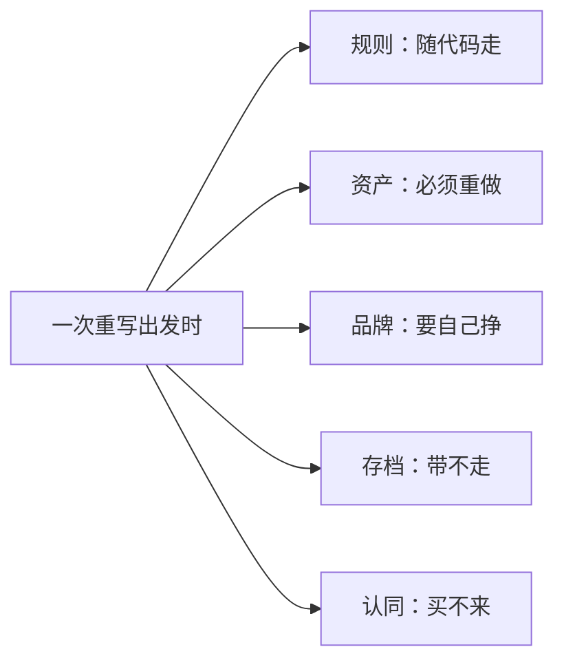

> **本章命题**：重写这件事没有任何一方能独自承诺完整——社区项目缺资产与长期，官方缺动机，开源社区缺存档与认同；而一次重写成不成立，不看它「更像」，只看那几条不变量是否仍在。

## 问题

前面几章一路考下来，技术卷已经交出了它的答案：可以重写。数据模型立得住，节拍抄得走，协议讲得清，渲染有路可循。从工程的角度看，「能不能重写」这道题有答案，答案是有希望的「能」。

但「能不能」和「可以不可以」是两个问题。前者问技术上办不办得到，后者问规则上和道义上容不容得。后半道题的一半是法律：行为规则可以照着做吗？贴图可以拿来用吗？名字可以随便叫吗？另一半是伦理：就算规则容得，一个重写项目对它的用户承诺了什么，其中哪些兑现得了？

本章把能说清的说清。先把被重写的东西拆成三件——协议、资产、品牌；再把动手的人分成三种主体——社区项目、官方、开源社区；把用的人分成三种用户——模组作者、服主、教育者。然后逐一盘点每一方能承诺什么、注定承诺不了什么。全章要回答的只有一个问题：**谁能承诺什么？**

先把丑话说明白：

<Note>本章不是法律意见。本章讨论的是能力边界与承诺范围，不回答任何具体法域里「这样做违不违法」。涉及版权与商标的实际问题，请咨询专业人士。</Note>

## 三件不能混的东西

混淆是这一层所有糊涂的源头。「我重写了 Minecraft」这句话，背后可能藏着三件完全不同的事，得一件一件拿出来看。以下只描述普遍实践与公开指引，不构成法律判断。

### 协议：世界怎么运转的规则

协议是行为规则：挖掉方块会掉落什么、水碰到岩浆会发生什么、一格火把能把光送多远、客户端和服务器之间说什么话。它是「这个游戏怎么运转」的那套约定。

协议有个特别之处：它活在效果里，不活在文件里。你观察玩家挖一块石头、看水流进一个坑，就能把大部分规则反推出来。这正是本卷前几章敢逐章考它的原因——规则可以被观察、被理解、被重新实现。

### 资产：贴图、音效和代码文本

资产是具体的表达：草方块顶上那张贴图、打开箱子时那一声响、每种生物的模型，以及一件容易被忽略的东西——代码文本本身。一份具体写出来的代码文件，同样是被保护的表达，哪怕它描述的内容是规则。

拿协议和资产放在一起，区别立刻清楚。你可以自己写一套光照传播，写完的行为和原作分毫不差，这是对规则的重实现；但你不可以把官方的贴图文件直接打包进自己的发行版——哪怕只拿一张，哪怕旁边注明「原图出自原作」。前者重做的是「怎么运转」，后者搬运的是「别人画出来的东西」。

### 品牌：名字和它指向的公众认知

品牌是商标与公众认知。「Minecraft」这个名字本身受商标保护，而它身后二十年攒下的公众印象同样算在内——提到这三个字，人们脑子里浮现的是什么，这不是小事。官方的玩家与创作者使用指引写明：第三方产品不得把「Minecraft」用作主名称或主标题，只能用作次要名称或说明[^usage]。

日常讨论里，两个方向的混淆都常见。一种以为复刻了协议就什么都有了，于是既打包官方贴图、又顶着原名发售——三把锁一口气撞上了两把；另一种以为连名字都受保护，行为规则必然也被锁死，于是断定重写无路可走——其实第一把锁从来不为规则上锁。把三件东西拆开，两条路都看得见：规则可以重做，表达必须自产，名字得另起。

三件东西可以分开验证。一个把协议复刻得分毫不差的项目，可以让你连上行为一模一样的服务器，但它不能管自己叫 Minecraft，也不能把官方贴图打包进安装包；反过来，官方握着全部资产和品牌，也管不着别人写一个行为规则类似的方块世界。三把锁，三把钥匙，锁的从来不是同一扇门。

## 三种主体能承诺什么

### 社区项目：有代码，没资产，难有长期

社区重写项目能承诺的是代码与规则：自己写的实现、自己画的贴图、自己定的授权条款，白纸黑字，全部可查。

它承诺不了的，首先是资产。官方那套贴图和音效轮不到它用，一切表现素材都得自己重做；其次是长期。志愿项目的寿命跟着维护者的热情走，热情退了，更新就停——「长期维护」这条承诺没有违约金，因为它从来写不进合同。连存档兼容都悬：世界格式是它自己定义的，项目一停，玩家手里的世界就成了新一批打不开的档案。

名称上的普遍实践也落在这一节：克隆项目几乎都避开「Minecraft」这个名字，宁可自起一名。这不是谁下发的命令，而是二十年里被反复验证的边界感。

### 官方：什么都能承诺，唯独没有动机

官方是唯一握有全部三件东西的主体：协议它最懂，资产它是主人，品牌它说了算。论「有权重写」，它排第一，可它偏偏最没有动机。重写意味着打断自己最值钱的连续性：版本一版接一版地更替，玩家的存档、模组、服务器全都押在这条不能断的时间线上。让官方重写 Minecraft，有点像让邮局重写地址系统——它最大的资产，恰恰是地址从没变过。

官方也不是没做过重写。基岩版就是官方自己做过的一次完整重写：实现另起炉灶，资产与品牌全数保留，两套版本并存至今。这次重写恰好印证了本节的判断——官方出手时，能把三件东西全部带过去；它只是很少觉得需要再带一次。

### 开源社区：规则可以复制，认同复制不来

开源社区能承诺的是规则可复制：代码公开，任何人可以拿走、修改、再分发，规则跟着代码走。它承诺不了的，一头是存档，一头是认同，下一节展开。这里先看一个现成的注脚：2024 年，运行多年的开源项目 Minetest 改名为 Luanti，官方博文明说，旧名字常被读成「对某个知名游戏的模仿」，而这个项目实际是一个引擎[^luanti]。规则它早就自己写了，名字投下的阴影却跟了十几年——品牌不随代码走，名声得自己挣。

三本账摆在一起，结论自己浮出来：

<Constraint name="没有全权重写者" verdict="地基" chain="社区项目有代码、缺资产、难保长期 → 官方什么都有、唯独没有动机 → 开源社区有规则、缺存档与认同 → 承诺注定分散在不同主体手里，任何「我全都有」的宣称都值得多问一句" />

## 三种用户的不同需求

重写给谁看，决定了它讨好谁；讨好谁，就注定失去另外谁。

**模组作者**要的是接口稳定。他们押上的是几百行代码和几年的维护，赌的是「明年我的模组还能跑」。对重写，他们最先问的不是「像不像」，而是「接口变不变」——接口一换，整个依赖它的模组生态都得跟着返工。重写对这群人最大的冒犯，恰恰是「推倒重来」这四个字本身。

**服主**要的是性能和治理工具。他们押上的是一台开机就不能停的服务：白天处理玩家的申诉，半夜备份世界文件，插件一失效，论坛上排队的全是投诉。对他们来说，「更像原作」毫无价值，「少宕机一次」价值千金。一个行为分毫不差、高峰期却卡成幻灯片的重写，在他们那里直接出局。

**教育者**要的是可控与合规。课堂不是公共服务器：得有白名单，得管得住学生之间说什么，得能向学校和家长解释清楚数据存在哪、谁能看到。开源重写对他们有天然的吸引力——一切可审计；但资产与品牌的边界同样绕不开：拿别人画的素材装点课堂，和商业公司拿它盈利，踩的是同一条线。

三个群体，三种赌注，彼此并不兼容。迁就模组作者就得背上接口兼容的包袱，改动慢如旧船；迁就服主就得把预算全押给性能，接口说砍就砍；迁就教育者就得层层加管控，模组作者最先抗议。**重写讨好谁，就失去谁**——想讨好所有人的那一个，往往谁也没讨好。

<Alternative title="不以「整个 Minecraft」为目标的重写">三类用户各自催生过更聚焦的重写：只追求性能的服务端实现、只面向课堂的受控版本、只为某个模组生态续命的兼容层。它们放弃「全都像」，只对一类用户的赌注负责，反而常常活得踏实。全量重写不是唯一诚实的选择，聚焦同样是。</Alternative>

## 开源的边界

回到最常见的那个说法：「代码都开源了，还有什么复制不来？」答案是：有，而且恰好是最重的两样。

头一样是存档。开源复制的是规则，规则随代码走，二十年攒下来的世界却不随代码走。卷一讲文化遗产的那一章[《作为文化遗产的 Minecraft》](/history/heritage)说过：版本有人抢救，而**服务器与模组的大规模归档，至今接近空白**——服务器最值钱的从来不是世界文件，而是那群同时在线的人；文件拷得走，社会拷不走。一个完美的开源重写，打开 2012 年的服务器存档时照样一筹莫展：当年的模组凑不齐，当年的玩家叫不回。它拿到了引擎，没拿到那二十年。

另一样是认同。「这是 Minecraft」的判定权不在任何代码仓库里，而在玩家社区的长年公认里——本卷第 2 章把这位裁判写进了答题纸。代码仓库可以另起一份拷贝，认同拷贝不来：Luanti 花了十几年才让「它不是仿品」这件事被普遍接受，而它付出的代价，恰恰是放弃了一个蹭着原作的名字。新名字要被念熟，新信任要一局一局地攒——这两样，托管代码的服务一样也送不了。

一次重写出发时能带走什么、带不走什么，可以画成一张清单：

五项里只有第一项是开源白送的。剩下四项，一项要动手，一项要花钱花时间，两项要年头。

## 判定标准：不变量仍在

最后的问题是验收。一个重写项目做完了，凭什么说它成了？

最常见的答案是「更像」：像素更接近了，方块更像了，连合成台的摆法都复刻了。这个标准恰好站不住，而且本卷第 2 章已经证伪过它一半：表征可以整层换掉而产品仍是它——资源包把石头换成水彩，没人因此不认识 Minecraft；反过来，截图骗得过老玩家五秒钟，机制走样的话五分钟就露馅。「像」从来只是表皮的属性。「更像」还有一个实践中的优势：它可以靠截图验收，发一帖就能收获掌声；不变量却要玩上几十个小时才验得出来。低标准跑得快，不是因为它对，而是因为它便宜。

真正的验收标准，是那七条不变量还在不在。一米网格与可破坏性、世界即库存、最小动词集、目标外包、可误用系统的物理开放性、世界比引擎活得久、再开发第一公民——[第 2 章的清单](/rewrite/invariants)逐条写着拿掉什么、玩家会立刻察觉什么。重写成功的标志，不是截图骗过老玩家，而是老玩家在里面玩出一个原作没有的玩法之后，说了一句「这就是 Minecraft 该有的样子」。

产品层之外还有架构层。卷三结语[《可被模组的引擎才是完整产品》](/impl/modifiable-engine)留下五条最小内核——一本账、一座钟、一个裁判、一张表单、几道活门；其中「世界比引擎活得久」这一条对重写最要命：如果你的重写让旧存档打不开，你就亲手杀掉了自己最该保护的东西。一份合格的重写要同时交两份答卷：内核立得住，不变量数得齐。

<Constraint name="验收看不变量" verdict="地基" chain="截图像只能骗过五秒 → 机制走样五分钟识破 → 七条不变量逐条过堂 → 过了才配继承这个玩法，哪怕法律上从不用这个名字" />

这也解释了为什么本章通篇不回答「该不该重写」。本卷是思想实验，不是开工令：拆承诺、数不变量，是为了让任何人在动手之前先看清自己签的是什么合同——承诺了什么，放弃了什么，最后拿什么验收。看清之后再做决定，做与不做都算清醒；看不清就动手，做出的东西往往三件都想拿，结果三件都拿不牢。至于这场考试最终为了什么，全书结语[《重写是为了看清原作》](/rewrite/seeing-the-original)会给出答案：重写不是造替代品，是把原作看穿。

## 这一章留下什么

- **爱好者**：再看到「完美复刻」时先数三件事——协议、资产、品牌它各承诺了哪件；缺的那两件，它打算怎么补，还是根本没打算补。
- **开发者**：能抄走的是这份承诺清单——动工前写明自己能承诺哪几件、放弃哪几件，验收数不变量、不数相似度；抄不走的是把别人没承诺的东西算进自己的预算。

[^usage]: Mojang Studios，《Minecraft Usage Guidelines》（面向玩家与创作者的使用指引），minecraft.net 官方网站，在线文档，2026 年 9 月查阅；见 https://www.minecraft.net/en-us/usage-guidelines 。指引明确：第三方产品不得将「Minecraft」用作主名称或主标题，仅可作次要名称或说明使用。

[^luanti]: Luanti Team，《Introducing Our New Name》，Luanti 官方博客，2024 年 10 月 13 日；见 https://blog.luanti.org/2024/10/13/Introducing-Our-New-Name/ 。文中说明更名原因：旧名「Minetest」常被读成对某个知名游戏的模仿，而该项目实际是一个体素游戏引擎。
